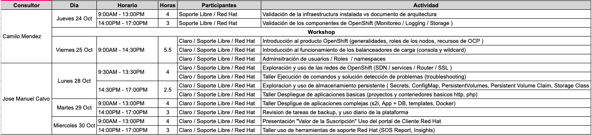

# Acceso Cluster OpenShift Workshop Claro

## Por Navegador
```
https://loadbalancer.1b84.example.opentlc.com/
```

## Acceso por SSH a la maquina Bastion
```
ssh user40@bastion.1b84.example.opentlc.com
oc login https://loadbalancer.1b84.internal:443 -u user40 -p redhat01
```

## Notas Compartidas
https://etherpad.net/p/WSClaroEcuador

## Facilitador / Consultor Red Hat
# Jose Manuel Calvo I

## Agenda


# Recursos de OpenShift
```
Projects
Pods
Services | svc
Routes
Secrets
ConfigMap
ImageStream | is
Templates
PersistentVolume | pv
PersistentVolumeClaim | pvc
DeploymentConfig | dc
BuildConfig | bc
Replication Controller | rc
nodes				# cluster admin command
users				# cluster admin command
```

# Comandos de inicio de OCP
```
oc types		     # Descripcion de los recursos de OpenShift
oc login [<cluster>]         # Loguearse a un cluster de OpenShift
oc list project              # Listar proyectos
oc project <project>         # Cambiarse entre proyectos
oc new-project <project>     # Crear proyectos
oc status		     # Estatus de login, proyecto actual
oc whoami -t                 # Obtener los datos del usuario con el que esta conectado
oc logout		     # Desloguearse de un cluster de OpenShift
oc delete project	     # Elimiar un proyecto y todo sus recursos
```

## Ejemplos
```
oc login https://loadbalancer.1b84.internal:443 -u user40 -p redhat01
oc new-project myapp
oc project myapp
oc delete project myapp
```

# Creacion y eliminar de aplicaciones en OpenShift basadas en:
```
oc new-app -S php
oc new-app -S --template=ruby 		  # Plantillas de OCP
oc new-app -S --image-stream=mysql	# Imagenes cargadas previamente en el servidor de registro de OCP
oc new-app -S --docker-image=python	# Imagenes de un servidor de registro de Docker
```
## Ejemplos

OpenShift se encarga de conocer el lenguaje de programacion que se encuentra en el repo git y selecciona la imagen (is) requerida ej: php, ruby, java
```
oc new-app https://github.com/jmanuelcalvo/app.git --name=app1

Se indica la imagen (is) especifica (centos/ruby-25-centos7) a utilizar y la fuente del codigo en un repositorio git
oc new-app centos/ruby-25-centos7~https://github.com/sclorg/ruby-ex.git

Se utiliza la imagen (is) de MySQL y se le pasan los parametros como variables
oc new-app mysql MYSQL_USER=user MYSQL_PASSWORD=pass MYSQL_DATABASE=testdb -l db=mysql
oc new-app mysql:5.6 --name=mysql -e MYSQL_USER=user1 -e MYSQL_PASSWORD=mypa55 -e MYSQL_ROOT_PASSWORD=r00tpa55 -e MYSQL_DATABASE=testdb

Se utiliza una imagen de docker a partir de servidor de registro externo
oc new-app --docker-image=myregistry.com/mycompany/mysql --name=private

Se crea un archivo en formato yaml con la definicion de todos los recursos y se crea la app a partir del mismo
oc create -f app.yml

Elimina todos los recursos creados con el label app1
oc delete all -l app=app1

Elimina todos los recursos dentro del proyecto (menos el proyecto)
oc delete all --all
```

# Obtener informacion de OpenShift
Argumentos del comando OC para obtener detalles de los recursos
```
get
export
describe
edit

NOTA: Puede obtener la ayuda de cualquier comando con el parametro -h asi:
oc project -h
oc new-app -h
oc delete -h
oc get -h

y se pueden usar con la mayoria de recursos componiendo el comando de la siguiente forma:
```
## Ejemplos
```
oc get pod
oc get pod -o wide 		# Informacion adicional de los pod
oc get service
oc describe pod php-5fs4
oc describe service php
oc edit svc php			# Los svcs pueden ser accedidos por FQDN dentro del mismo proyecto a traves del SVC_NAME.PROJECT_NAME.svc.cluster.local
oc export svc,dc -l name=php
```


# Comandos para solucionar problemas
```
oc debug
oc logs
oc exec
oc get ev
oc rsh
oc describe
oc rsync
oc delete
oc port-forwaed
```

## Ejemplos
```
oc debug dc/test
$ oc debug dc/test -o yaml
oc logs -f <pod>	| 	oc logs -f php-5fs4
oc exec <pod> [-c <container>] <command> | oc exec php-5fs4 ps xa
oc rsh <pod> |	oc rsh php-5fs4
oc rsync <local_dir> <pod>:<pod_dir> -c <container>
oc rsync <pod>:<pod_dir> <local_dir> -c <container>
oc port-forward <pod> <local_port>:<remote_port>
oc port-forward  mysql-1-t3qfb 13306:3306	| 	mysql -h127.0.0.1 -P13306 -uuser1 -pmypa55
```


# Miselaneos
Comandos con ansible desde bastion
Comandos de git


# Almacenamiento

## Creacion de configMap
oc create cm myconf --from-literal APP_MSG="Test Message"
oc set env dc/mydcname --from configmap/myconf
oc rollout latest dc/mydcname

curl http://app1-jmanuel-project1.apps.1b84.example.opentlc.com/var.php

## Creacion de Secret
vim myapp.sec
username=user1
password=pass1

oc create secret generic mysecret --from-file myapp.sec
oc set env dc/app1 --from secret/mysecret


# Backup OpenShift

## Backup de Proyectos
Existe un procedimiento que se puede utilizar para realizar copias de seguridad de proyectos. El comando de exportación oc se utiliza para hacer una copia de seguridad de los objetos a nivel de proyecto. Ejecute el comando para cada objeto que se guardará. Por ejemplo, para hacer una copia de seguridad del archivo de configuración de implementación front-end llamado frontend como dc-frontend en formato YAML, ejecute el siguiente comando:

```
[user@master ~]$ oc export dc frontend -o yaml > dc-frontend.yaml
```
Backup de un proyecto entero
```
[user@master ~]$ oc export all -o yaml > project.yaml
```
## Application Data Backup
Use el comando oc rsync para hacer una copia de seguridad de los datos de la aplicación cuando rsync está instalado dentro de un contenedor. También puede usar soluciones de almacenamiento como Cinder, Gluster y NFS.

## Project Restore
Para restaurar un proyecto, debe volver a crear todo el proyecto y todos los objetos que se exportaron durante el procedimiento de copia de seguridad. Use el comando oc create para restaurar los objetos que se guardaron.


# Tallers
[Taller 1](talleres/taller1.md)

[Taller 2](talleres/taller2.md)

[Taller 3](talleres/taller3.md)

[Taller 4](talleres/taller4.md)

[Taller 5](talleres/taller5.md)

[Taller 6](talleres/taller6.md)


