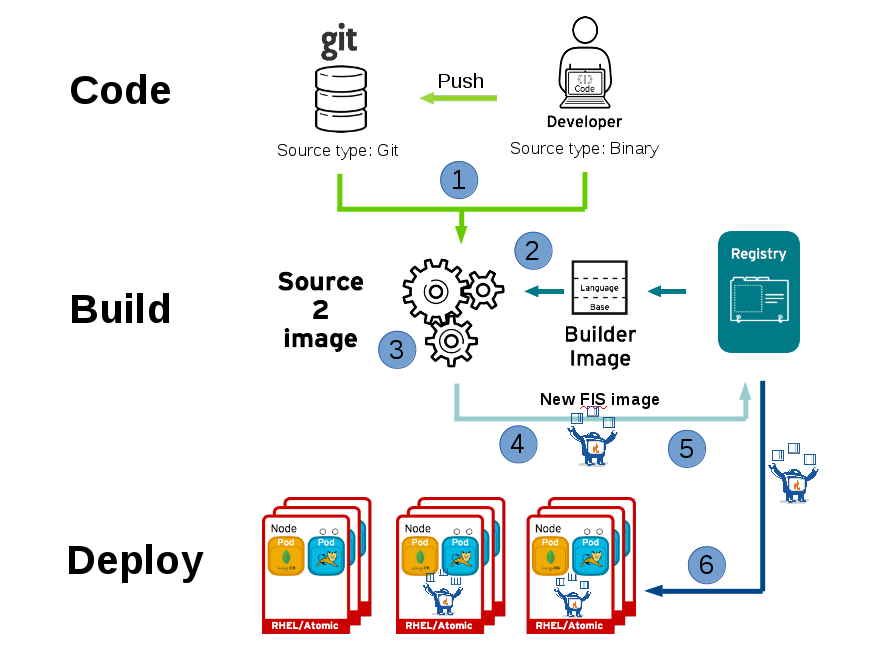

# Workshop OpenShift Conceptos Generales

## Arquitectura de referencia


## Antes de iniciar
Antes de iniciar, tenga en cuenta que a este workshop ingresaran varias personas, por lo que previo a esto es necesario que cada uno seleccione un numero de usuario y con este trabajara durante todos los talleres
Ejemplo:

* user01 - Jose Manuel
* user02 - German Pulido
* user03 - Camilo Astros
* user04 - Camilo Mendez

y asi sucesivamente, una vez tenga **su usuario**, durante los talleres reemplaze **userXX** por **user04** (o su usuario asignado)

Las contraseñas de los usuarios tanto por SSH como por consola seran redhat01

## Por Navegador
```
https://loadbalancer.2775.example.opentlc.com/
```

## Acceso por SSH a la maquina Bastion
```
ssh user0X@bastion.2775.example.opentlc.com
oc login https://loadbalancer.2775.internal:443 -u user0X -p redhat01
```


## Facilitador / Consultor Red Hat
Jose Manuel Calvo I


# Laboratorios
[Taller 1](talleres/taller1.md) - Iniciando con OpenShift - Comandos, creacion de recursos (proyectos, apps, svc, routes)

[Taller 2](talleres/taller2.md) - Volumenes Persistentes, ConfigMap y Secrets

[Taller 3](talleres/taller3.md) - Aplicaciones complejas (FrontEnd + BD + Datos Persistentes)

[Taller 4](talleres/taller4.md) - Trabajo con contenedores Docker

[Taller 5](talleres/taller5.md) - Backup de OpenShift

[Taller 6](talleres/taller6.md) - Tareas automatizadas con Ansible, Primeros pasos

[Taller 7](talleres/taller7.md) - Tareas de Operacion de OpenShift


------------

# Workshop Despliegue de aplicaciones en OpenShift

## Imagen de referencia





# Laboratorios

[Taller 1](talleresd/taller1.md) - Despliegue de aplicaciones desde Docker y s2i

[Taller 2](talleresd/taller2.md) - Uso de repositorios GIT

[Taller 3](talleresd/taller3.md) - Configuracion de limites y quotas en los pods

[Taller 4](talleresd/taller4.md) - Configuracion de Rutas - Estrategias de despliegues avanzadas


------------
# Varios  


# Backup OpenShift
### Ver taller 5

Informacion oficial del proceso de backup y restauracion de OCP
https://docs.openshift.com/dedicated/3/admin_guide/assembly_backing-up-restoring-project-application.html

# Operacion Cluster OpenShift - Varios
Procedimiento de apagado/mantenimiento de un nodo de OpenShift
https://docs.openshift.com/container-platform/3.11/admin_guide/manage_nodes.html
```
[root@bastion ~]# oc adm manage-node node3.xxxx.internal --schedulable=false
[root@bastion ~]# oc adm drain node3.xxxx.internal --delete-local-data --ignore-daemonsets
[root@bastion ~]# ssh  node3.xxxx.internal reboot
```
Cuando el nodo vuelva a estar disponible, se debe poner nuevamente en status schedulable
```
[root@bastion ~]# oc adm manage-node node3.1b84.internal --schedulable=true
```
