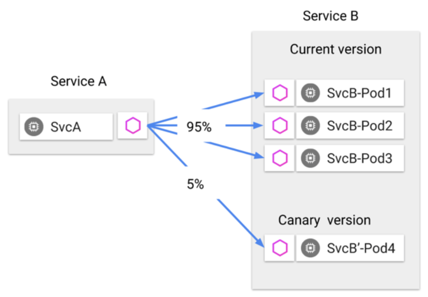
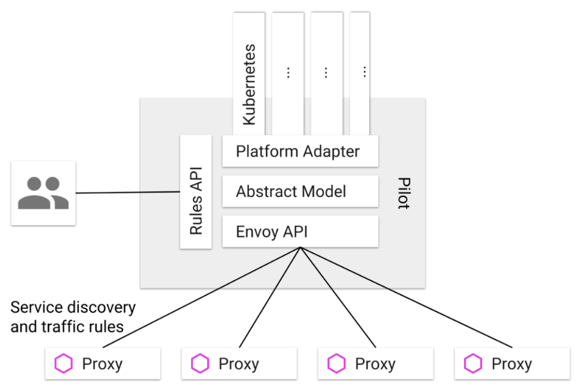

# Instalacion de Istio como Operador


El Repositorio incluye ejemplos de recursos personalizados en openshift-ansible/istio:

* istio-installation-minimal.yaml: Minimal Red Hat OpenShift service mesh installation
* istio-installation-kiali.yaml: Basic Red Hat OpenShift service mesh installation, including Kiali
* istio-installation-full.yaml: Full Red Hat OpenShift service mesh installation, all features enabled

Examples must be customized before deployment

1. Clonar el proyecto:
```
git clone https://github.com/Maistra/openshift-ansible
```
2. Crear un nuevo proyecto istio-operator:
```
oc new-project istio-operator --display-name="Service Mesh Operator"
```
3. Crear el operator:
```
oc process -f $HOME/openshift-ansible/istio/istio_product_operator_template.yaml --param=OPENSHIFT_ISTIO_MASTER_PUBLIC_URL=$(oc whoami --show-server) | oc create -f -
```


# Traffic Management

Red Hat® OpenShift® service mesh traffic management desacompla el decouples traffic flow and infrastructure scaling

* Use Pilot para especificar reglas para la gestión del tráfico entre pods
* Pilot y Envoy gestionan qué pods reciben tráfico
* Ejemplo: El Service A llama al Service B

Use Pilot para especificar que desea:
95% del tráfico enrutado al Service B, pods 1–3
5% del tráfico enrutado al Service B, pod 4




# Componentes de Service Mesh
## Pilot

* Administra y configura instancias de proxy Envoy (sidecar) en la malla de servicio
* Le permite especificar reglas de enrutamiento para usar entre servicios en la malla de servicios
* Permite el descubrimiento de servicios, actualizaciones dinámicas para el balanceador de carga, tablas de enrutamiento

## Envoy
Cada instancia de proxy de Envoy obtiene y mantiene información de configuración de Pilot




## Mixer

# Solicitudes de enrutamiento
Comunicación entre servicios
- Los clientes de servicio no tienen conocimiento de las diferentes versiones de servicio.
- Los clientes acceden a los servicios utilizando el hostname del servicio o IP
- Envoy proxy/sidecar intercepta, reenvia solicitudes/respuestas entre el cliente y el servicio
- Envoy determina el servicio para usar dinámicamente en función de las reglas de enrutamiento configuradas con Pilot
- Las reglas de enrutamiento permiten a Envoy seleccionar la versión en función de las condiciones, como:
*Headers
*Tags associados con fuente/destino
*Pesos asignados a cada versión
