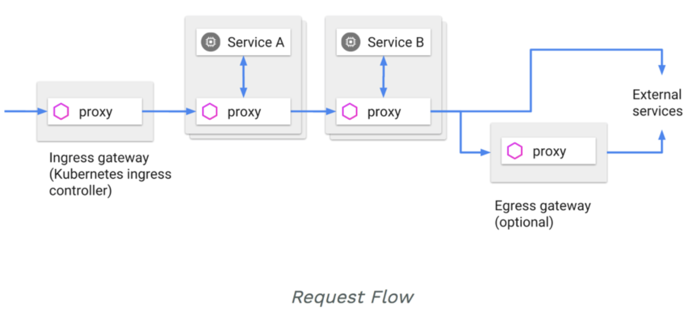
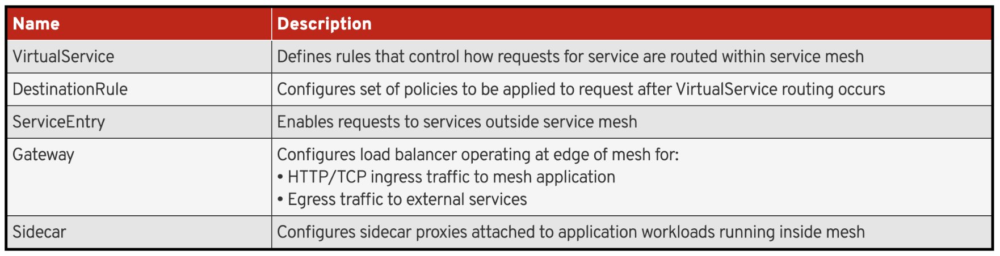

#  Red Hat OpenShift Service Mesh

Basado en el proyecto de código abierto Istio, Red Hat OpenShift Service Mesh agrega una capa transparente en las aplicaciones distribuidas existentes sin requerir ningún cambio en el código de servicio. Agrega soporte de Red Hat OpenShift Service Mesh a los servicios mediante la implementación de un proxy especial de sidecar a los servicios relevantes en la malla que intercepta toda la comunicación de red entre microservicios. Usted configura y administra la malla de servicio utilizando las características del plano de control.

Red Hat OpenShift Service Mesh le brinda una manera fácil de crear una red de servicios implementados que brindan:

Descubrimiento ( Discovery )
Balanceo de carga ( Load balancing )
Autenticación de servicio a servicio ( Service-to-service authentication )
Recuperación de fallas ( Failure recovery )
Métrica ( Metrics )
Monitoring ( Monitoreo )

Service Mesh también proporciona funciones operativas más complejas que incluyen:

Pruebas A / B ( A/B testing )
Lanzamientos canarios ( Canary releases )
Limitación de velocidad ( Rate limiting )
Control de acceso ( Access control )
Autenticación de extremo a extremo ( End-to-end authentication )


# Instalacion de Istio como Operador


El Repositorio incluye ejemplos de recursos personalizados en openshift-ansible/istio:

* istio-installation-minimal.yaml: Minimal Red Hat OpenShift service mesh installation
* istio-installation-kiali.yaml: Basic Red Hat OpenShift service mesh installation, including Kiali
* istio-installation-full.yaml: Full Red Hat OpenShift service mesh installation, all features enabled

Examples must be customized before deployment

1. Clonar el proyecto:
```
git clone https://github.com/Maistra/openshift-ansible
```
2. Crear un nuevo proyecto istio-operator:
```
oc new-project istio-operator --display-name="Service Mesh Operator"
```
3. Crear el operator:
```
oc process -f $HOME/openshift-ansible/istio/istio_product_operator_template.yaml --param=OPENSHIFT_ISTIO_MASTER_PUBLIC_URL=$(oc whoami --show-server) | oc create -f -
```


# Traffic Management

Red Hat® OpenShift® service mesh traffic management desacompla el decouples traffic flow and infrastructure scaling

+ Use Pilot para especificar reglas para la gestión del tráfico entre pods
+ Pilot y Envoy gestionan qué pods reciben tráfico
+ Ejemplo: El Service A llama al Service B

+ Use Pilot para especificar que desea:
  + 95% del tráfico enrutado al Service B, pods 1–3
  + 5% del tráfico enrutado al Service B, pod 4


# Componentes de Service Mesh
## Pilot

* Administra y configura instancias de proxy Envoy (sidecar) en la malla de servicio
* Le permite especificar reglas de enrutamiento para usar entre servicios en la malla de servicios
* Permite el descubrimiento de servicios, actualizaciones dinámicas para el balanceador de carga, tablas de enrutamiento

## Envoy
Cada instancia de proxy de Envoy obtiene y mantiene información de configuración de Pilot


## Mixer

# Solicitudes de enrutamiento
## Comunicación entre servicios
+ Los clientes de servicio no tienen conocimiento de las diferentes versiones de servicio.
+ Los clientes acceden a los servicios utilizando el hostname del servicio o IP
+ Envoy proxy/sidecar intercepta, reenvia solicitudes/respuestas entre el cliente y el servicio
+ Envoy determina el servicio para usar dinámicamente en función de las reglas de enrutamiento configuradas con Pilot
+ Las reglas de enrutamiento permiten a Envoy seleccionar la versión en función de las condiciones, como:
   + Headers
   + Tags associados con fuente/destino
   + Pesos asignados a cada versión

## Ingreso y egreso
+ En Red Hat OpenShift service mesh, el tráfico que ingresa y sale de la malla del servicio transita a través de servidores proxy Envoy
+ Tener un proxy Envoy frente a los servicios le permite realizar pruebas A/B, implementar despliegues canary, etc.
+ Para acceder a servicios externos, agregue funciones de recuperación de fallas (failure-recovery): tiempos de espera (timeouts), reintentos (retries), etc.




# Configuración de regla
+ Red Hat OpenShift service mesh proporciona un modelo de configuración simple
  + Controla cómo las llamadas API y el tráfico de capa 4 fluyen a través de los servicios en la implementación de aplicaciones
  + Le permite configurar propiedades de nivel de servicio, por ejemplo,  disyuntores, tiempos de espera, reintentos (circuit breakers, timeouts, retries)
+ También puede configurar tareas comunes de implementación continua:
  + Lanzamientos canarios ( Canary rollouts )
  + Pruebas A / B ( A/B testing )
  + Lanzamientos por etapas con divisiones de tráfico basadas en porcentajes ( Staged rollouts with percent-based traffic splits )

+ Reglas de configuración deben ser definidas en un archivo de configuración YAML
+ Cinco recursos de configuración de gestión de tráfico en Red Hat OpenShift service mesh
## Recursos



### Ejemplo VirtualService:
#### VirtualService
Define reglas que controlan cómo se enrutan las solicitudes de servicio dentro de la malla de servicios

Envíe el 100% del tráfico entrante al servicio reviews a la versión v1
```
vim review-virtual-service.yaml

apiVersion: networking.istio.io/v1alpha3
kind: VirtualService
metadata:
  name: reviews
spec:
  hosts:
  - reviews
  http:
  - route:
    - destination:
        host: reviews
        subset: v1
```    

### Ejemplo DestinationRule:
#### RuleDestination
Las reglas de enrutamiento corresponden a uno o más hosts de destino especificados en la configuración de VirtualService

Puede adicionar politicas en DestinationRule
Ejemplo usando balanceador de cargas aleatorio (random )
```
vim review-destination-rule.yaml

apiVersion: networking.istio.io/v1alpha3
kind: DestinationRule
metadata:
  name: reviews
spec:
  host: reviews
  trafficPolicy:
    loadBalancer:
      simple: RANDOM
  subsets:
  - name: v1
    labels:
      version: v1
  - name: v2
    labels:
      version: v2
```

### Aplicando Reglas
Para configurar reglas, use la utilidad de línea de comandos oc
Reglas aplicadas directamente, No es necesario reiniciar servidores o aplicaciones
```
# Create the destination rule
$ oc create review-destination-rule.yaml

# Create the virtual service
$ oc create review-virtual-service.yaml
```


# División de tráfico (Traffic Splitting)
+ Cada regla de ruta identifica uno o más weighted back ends ponderados para llamar cuando se activa la regla
+ Cada back-end corresponde a la versión del servicio de destino.
  + Versiones expresadas con etiquetas

+ Se enrutan varias instancias registradas con la misma etiqueta según la política de balanceo de carga configurada para el servicio
  + Predeterminado: Round-robin

### Ejemplo
+ Enrute el 75% del tráfico para el servicio reviews a instancias con etiqueta v1
+ Enrute el 25% restante a v2

```
apiVersion: networking.istio.io/v1alpha3
kind: VirtualService
metadata:
  name: reviews
spec:
  hosts:
    - reviews
  http:
  - route:
    - destination:
        host: reviews
        subset: v1
      weight: 75
    - destination:
        host: reviews
        subset: v2
      weight: 25
```


# Reglas condicionales (Conditional Rules )
+ Puede calificar las reglas para aplicar solo a las solicitudes que coinciden con una condición específica
+ Ejemplos:
  + Restrinja a cargas de trabajo específicas del cliente utilizando etiquetas de carga de trabajo (workload labels)
  + Seleccionar regla basada en encabezados HTTP (HTTP headers)
  + Seleccionar regla basada en el URI de solicitud (request URI)
  
### Ejemplo Restringir usando Workload Labels
Las reglas se aplican a las llamadas desde instancias de carga de trabajo (pods) que:

Implementar servicio de revisiones

Tengan la etiqueta v2
```
apiVersion: networking.istio.io/v1alpha3
kind: VirtualService
metadata:
  name: ratings
spec:
  hosts:
  - ratings
  http:
  - match:
    - sourceLabels:
        app: reviews
        version: v2
    route:
    ...
```

### Ejemplo Basado en HTTP Headers
+ La regla se aplica a la solicitud entrante si:
  + La solicitud incluye un encabezado HTTP personalizado (end-user)  para el usuario final
  + El encabezado contiene una cadena de cliente de gold (gold-customer)
  
```
apiVersion: networking.istio.io/v1alpha3
kind: VirtualService
metadata:
  name: reviews
spec:
  hosts:
    - reviews
  http:
  - match:
    - headers:
        end-user:
          exact: gold-customer
    route:
    ...
```

### Ejemplo Basado en Request URI
La regla se aplica a la solicitud si la ruta URI comienza con /api/v1
```
apiVersion: networking.istio.io/v1alpha3
kind: VirtualService
metadata:
  name: productpage
spec:
  hosts:
    - productpage
  http:
  - match:
    - uri:
        prefix: /api/v1
    route:
    ...
```

