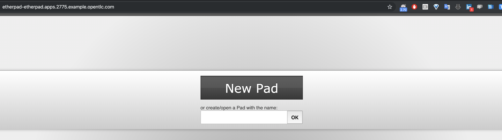
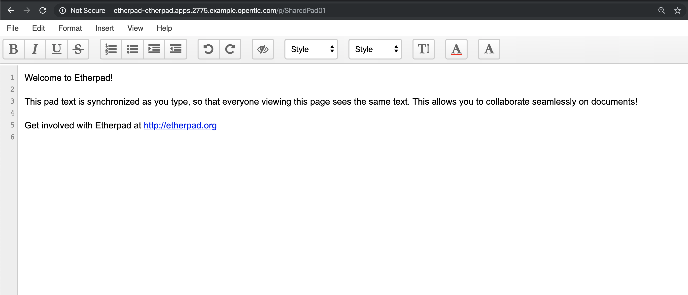

# Despliegue de aplicacion Etherpath

* informacion obtenida del repositorio
https://github.com/wkulhanek/docker-openshift-etherpad


## Etherpad Container for Red Hat OpenShift

This repository provides an Etherpad Container to be run on Red Hat OpenShift. While you can build it yourself the easiest way to set up is to just deploy the image:

1. Creacion del proyecto etherpad
```
[root@bastion ~]# oc new-project etherpad --display-name "Shared Etherpad"
```

2. Uso de la plantilla de mysql con datos persistentes que existe en OpenShift
```
[root@bastion ~]# oc new-app mysql-persistent --param MYSQL_USER=ether --param MYSQL_PASSWORD=ether --param MYSQL_DATABASE=ether --param VOLUME_CAPACITY=4Gi --param MYSQL_VERSION=5.7
```

3. Esperar aproximandamente 1 minuto mientras se crea el contenedor de la base de datos esta en estado Running
```
[root@bastion ~]# oc get pod
NAME            READY     STATUS    RESTARTS   AGE
mysql-1-6vpqf   1/1       Running   0          3m
```

4. Crear la aplicacion etherpad a partir de la plantilla e inyectandole como parametros (-p) los valores con los que la base de datos fue creada
```
[root@bastion ~]# oc new-app -f https://raw.githubusercontent.com/wkulhanek/docker-openshift-etherpad/master/etherpad-template.yaml -p DB_USER=ether -p DB_PASS=ether -p DB_DBID=ether -p DB_PORT=3306 -p DB_HOST=mysql -p ADMIN_PASSWORD=secret
--> Deploying template "etherpad/etherpad" for "https://raw.githubusercontent.com/wkulhanek/docker-openshift-etherpad/master/etherpad-template.yaml" to project etherpad

     Etherpad
     ---------
     A shared Notepad for an OpenShift Cluster.

     * With parameters:
        * NAME=etherpad
        * ADMIN_PASSWORD=secret
        * DB_DBID=ether
        * DB_HOST=mysql
        * DB_USER=ether
        * DB_PASS=ether
        * DB_PORT=3306
        * ETHERPAD_IMAGE=quay.io/wkulhanek/etherpad:latest

--> Creating resources ...
    deploymentconfig.apps.openshift.io "etherpad" created
    service "etherpad" created
    route.route.openshift.io "etherpad" created
    configmap "etherpad-settings" created
--> Success
    Access your application via route 'etherpad-etherpad.apps.2775.example.opentlc.com'
    Run 'oc status' to view your app.
    
```

5. Validar la ruta por la cual fue expuesta la aplicacion 

[root@bastion ~]# oc get route
NAME       HOST/PORT                                         PATH      SERVICES   PORT      TERMINATION   WILDCARD
etherpad   etherpad-etherpad.apps.2775.example.opentlc.com             etherpad   <all>                   None

6. Ingresar al navegador para visualizar y utilizar la aplicacion




7. Una vez en la aplicacion, puede crear notas compartidas entre sus colaboradores compartiendo con todos el url del pad


