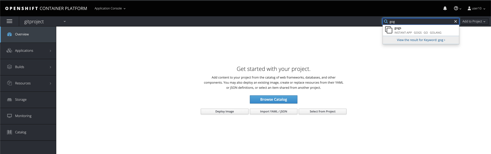
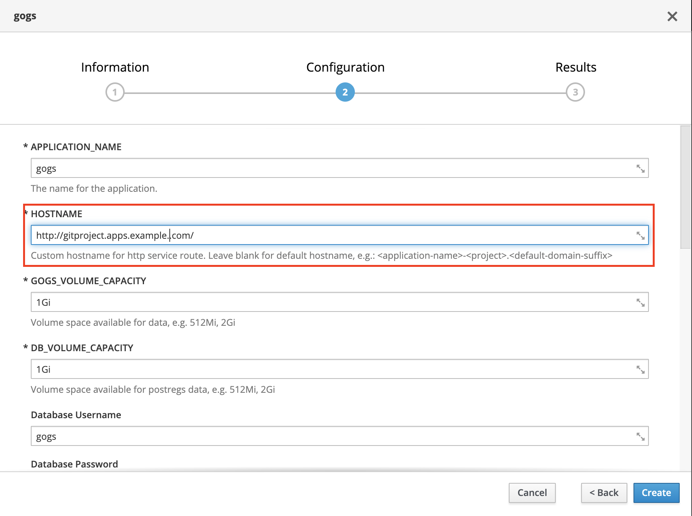
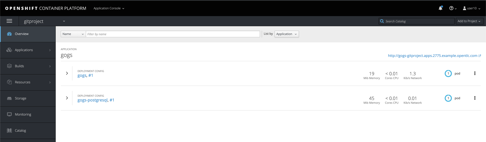
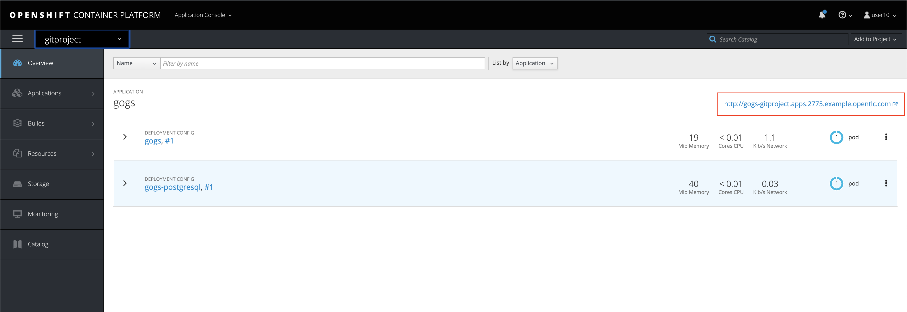
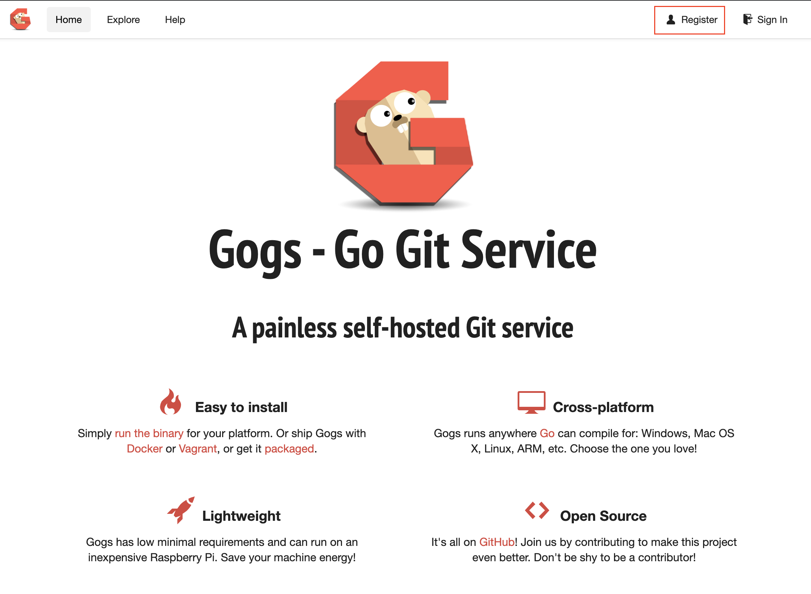
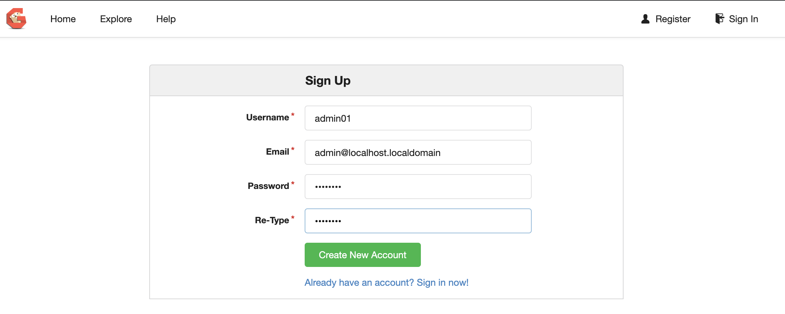

# Despliegue de aplicaciones varias y utiles sobre OpenShift

## Gogs - Go Git Service
Esta ese es un servidor de git similar a github o gitlab, que se puede desplegar sobre OpenShift a traves de una plantilla, de la siguiente forma:

* Cree el proyecto donde se instalara la aplicacion Gogs

```
[user0X@bastion ~]$ oc login -u user0X -p

[user0X@bastion ~]$ oc new-project gitproject
Now using project "gitproject" on server "https://loadbalancer.2775.internal:443".

You can add applications to this project with the 'new-app' command. For example, Try:

    oc new-app centos/ruby-25-centos7~https://github.com/sclorg/ruby-ex.git

to build a new example application in Ruby.

```

* Importe el la plantilla del proyecto Gogs a sus templates

```
[user0X@bastion ~]$ oc create -f https://raw.githubusercontent.com/OpenShiftDemos/gogs-openshift-docker/master/openshift/gogs-persistent-template.yaml
template.template.openshift.io/gogs created
```

**NOTA** en caso que no exista la plantilla puede descargar una copia desde mi repositorio

```
[user0X@bastion ~]$ oc create -f https://raw.githubusercontent.com/jmanuelcalvo/WSOpenShift/master/gogs-persistent-template.yaml
```

* Desde la interfase web, ingrese al proyecto y busque dentro de las aplicaciones la palabra gogs




* Proceda con el proceso de despliegue


http://git.apps.2775.example.opentlc.com/

* Por ultimo, debe concer cual es su dominio Wildcard, ya que este debe ser asociado en los parametros de configuracion



* Haga click en el boton create, y espere mientras se finaliza correctamente la creacion de los pods




* Una vez desplegada la aplicacion, haga click en la ruta



* Ya tiene una aplicacion GOGS desplegada correctamente sobre OpenShift, ahora debe ir al boton de Register para crear un usuario administrativo




* Cree un usuario administrativo (evite el nombre admin por que esta reservado) y este nuevo usuario tendra los privilegios para la configuracion del resto de la aplicacion con privilegios de usuario Super Admin


