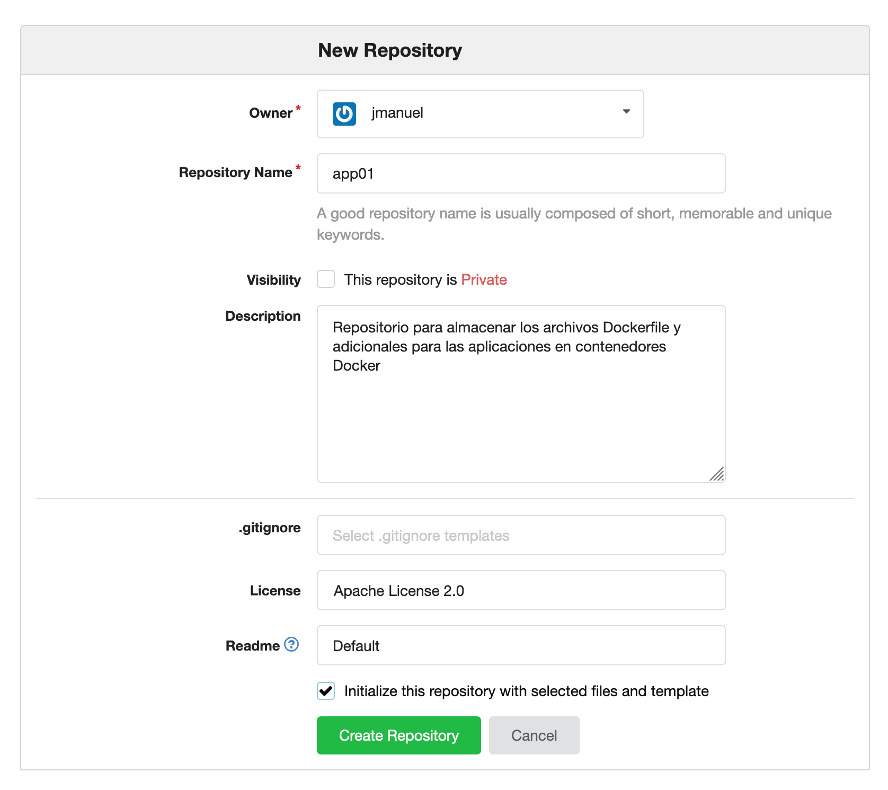
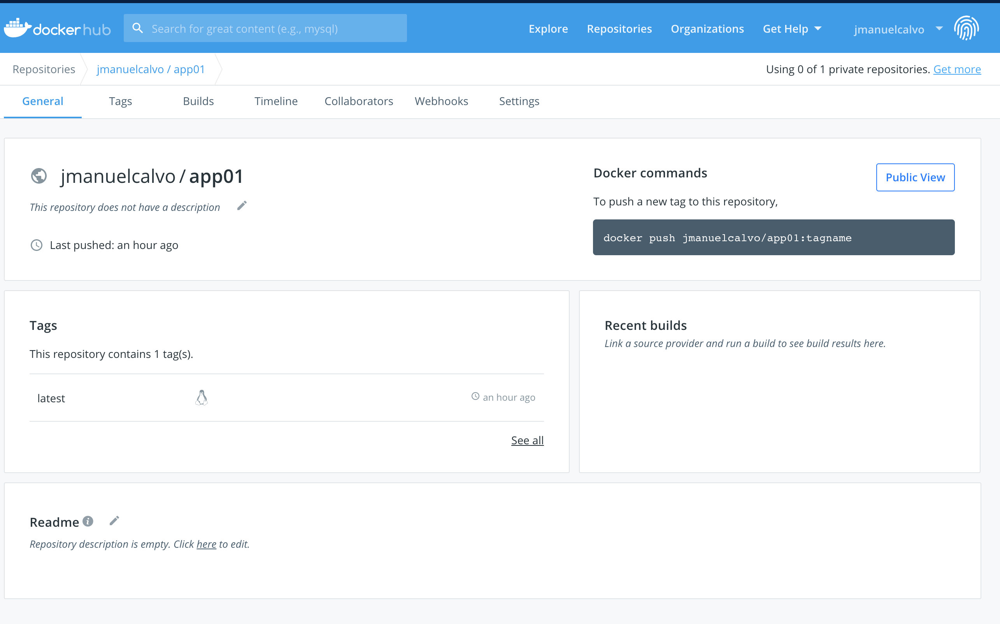

# Crear una aplicacion en docker lista para ejecutarse en OpenShift

1. Cree una cuentas en hub.docker.com

**NOTA:** Tenga en cuenta que los ejempos y salidas de comeando se realizan con el usuario jmanuelcalvo, reemplace este por el nombre de su usuario

2. Valide que tenga una cuenta en un servidor de repositorios git

http://gogs.apps.2775.example.opentlc.com

* user01  - redhat01
* user02  - redhat01
* user03  - redhat01
* user04  - redhat01
* user05  - redhat01

O si ya cuenta con una en GitHub github.com

3. Cree un repo desde al interfase web llamado app01
***IMPORTANTE***: al momento de crear el repo, seleccione:

Initialize this repositorio with selected files and templates



4. Dentro de la maquina bastion descargue su repositorio
```
ssh user0X@bastion.2775.example.opentlc.com.     -    password redhat01
git clone http://gogs.apps.2775.example.opentlc.com/jmanuel/app01.git
cd app01
```

5. Cree una archivo Dockerfile con el contenido del software que desea instalar

```
cat << EOF > Dockerfile
FROM centos:7

MAINTAINER Jose Manuel Calvo <jcalvo@redhat.com>

LABEL description="A basic Apache container on RHEL 7"

RUN yum -y install -y httpd && \
    yum clean all && \
    echo "Hello from the httpd container!" > /var/www/html/index.html

EXPOSE 8080

CMD  ["httpd", "-D", "FOREGROUND"]
EOF
```

***NOTA1*** : Es importante que el contenedor al momento de su ejecucion llame al comando CMD el cual garantiza cual va a ser el proceso de inicio del servicio, en caso que este parametro no se encuentre seteado, la ejecucion del contenedor va a fallar al momento del deploy dentro de OpenShift.

***NOTA2***:  El puerto de exposicion de la imagen sea mayor a 1024, ya que de lo contrario requiere privilegios de ejecucion el en cluster de OpenShift.


6. Compile su imagen de contenedor
```
docker build -t docker.io/jmanuelcalvo/app01 .
```

7. Valide que esta image quedo creada correctamente
```
docker images
```

8. Realícele las pruebas locales
```
docker run -d -p 8080:8080 --name=app01 docker.io/jmanuelcalvo/app01
```

9. Ingrese al contenedor y valide que todo esta funcionando de la forma deseada
```
docker exec -it app01 bash
exit
docker stop apache01
docker rm apache01
```

10. En este momento las imagen se encuentra en el cache de su maquina local, publique su imagen de contenedor en su servidor de registro

NOTA:
 Garantice que su IP p FQDN de registro este permitida por docker para publicar su registro
```
cat /etc/docker/daemon.json
{
"insecure-registries" : [ "docker-registry-default.apps.2775.example.opentlc.com", "docker.io" ]
```
En caso de contar realizar las pruebas con un servidor de registro alterno, indique por favor al facilitador para adicionarlo en la lista de servidores de registro autoriados

```
docker login docker.io
docker push docker.io/jmanuelcalvo/app01
```
Valide en el portal web de su servidor de registro o hub.docker.com que la nueva imagen se encuentre creada




11. No olvide también guardar los cambios de su imagen Dockerfile en el repositorio de git
```
git config --global user.name "Jose Manuel Calvo
git config --global user.email jmanuel@example.com
git add Dockerfile
git commit -m "Primera version de archivo Dockerfile"
git push
```

Valide en el portal web del Gogs los archivos de su repositorio

12. Loguese al OpenShift e intente desplegar la aplicacion a partir de un contenedor

```
[root@bastion ~]$ oc login -u user0X https://loadbalancer.2775.internal:443
[root@bastion ~]$ oc new-project app01
Now using project "app01" on server "https://loadbalancer.2775.internal:443".

You can add applications to this project with the 'new-app' command. For example, try:

    oc new-app centos/ruby-25-centos7~https://github.com/sclorg/ruby-ex.git

to build a new example application in Ruby.
```

Teniendo en cuenta que el contenedor de Apache requiere privilegios de root para iniciar el servicio, como usuario admin, se asignaran privilegios de ejecucion sobre los contenedores.

NOTA: esto no es lo mas recomendado, en los siguientes ejercicios se revisara en mayor detalle
```
[root@bastion ~]$ oc login -u admin1 -p redhat01
[root@bastion ~]$ oc adm policy add-scc-to-user anyuid -z default
[user10@bastion ~]$ oc login -u user10
Logged into "https://loadbalancer.2775.internal:443" as "user10" using existing credentials.

You have access to the following projects and can switch between them with 'oc project <projectname>':

  * app01
    etherpad

Using project "app01".
[user10@bastion ~]$ oc new-app --name app01 --insecure-registry --docker-image="docker.io/jmanuelcalvo/app01:latest"
--> Found Docker image 5d8ddbd (2 hours old) from docker.io for "docker.io/jmanuelcalvo/app01:latest"

    * An image stream tag will be created as "app01:latest" that will track this image
    * This image will be deployed in deployment config "app01"
    * Port 80/tcp will be load balanced by service "app01"
      * Other containers can access this service through the hostname "app01"
    * WARNING: Image "docker.io/jmanuelcalvo/app01:latest" runs as the 'root' user which may not be permitted by your cluster administrator

--> Creating resources ...
    imagestream.image.openshift.io "app01" created
    deploymentconfig.apps.openshift.io "app01" created
    service "app01" created
--> Success
    Application is not exposed. You can expose services to the outside world by executing one or more of the commands below:
     'oc expose svc/app01'
    Run 'oc status' to view your app.
[user10@bastion ~]$ oc get pod
NAME            READY     STATUS    RESTARTS   AGE
app01-1-hsz5n   1/1       Running   0          6s

```

13. Exponga la ruta y conectese al servicio

```
[user10@bastion ~]$ oc get svc
NAME      TYPE        CLUSTER-IP      EXTERNAL-IP   PORT(S)   AGE
app01     ClusterIP   172.30.100.94   <none>        80/TCP    1m
[user10@bastion ~]$ oc expose svc app01
route.route.openshift.io/app01 exposed

[user10@bastion ~]$ oc get route
NAME      HOST/PORT                                   PATH      SERVICES   PORT      TERMINATION   WILDCARD
app01     app01-app01.apps.2775.example.opentlc.com             app01      80-tcp                  None

[user10@bastion ~]$ curl  app01-app01.apps.2775.example.opentlc.com
Hola from the httpd container!
```
