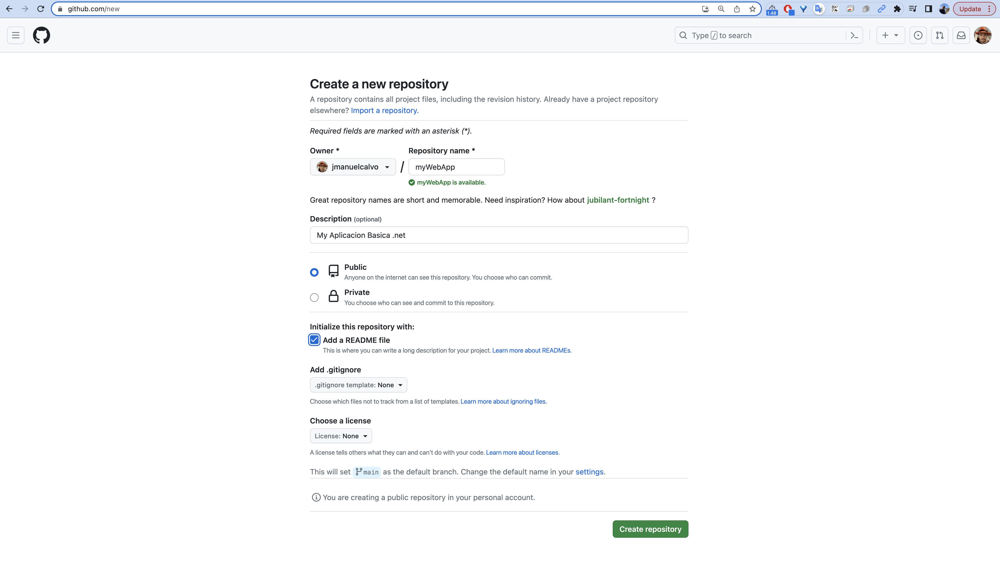
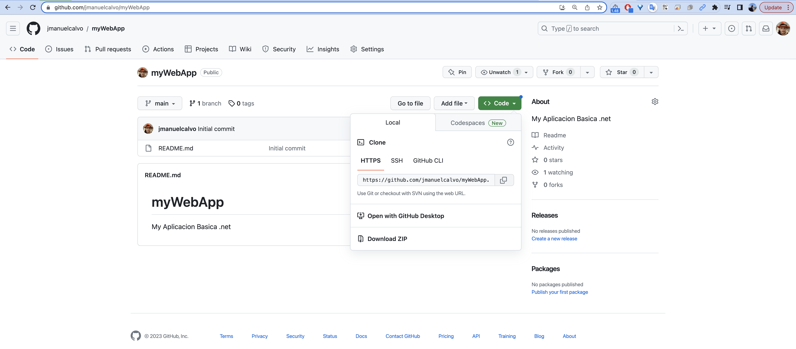
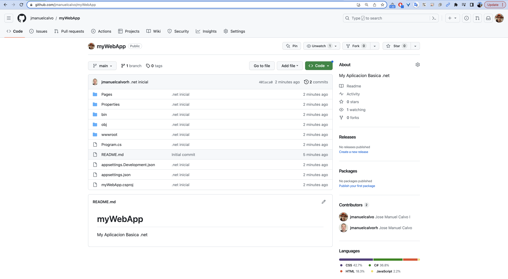
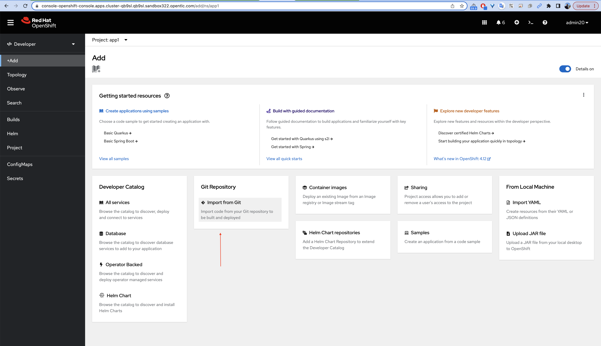
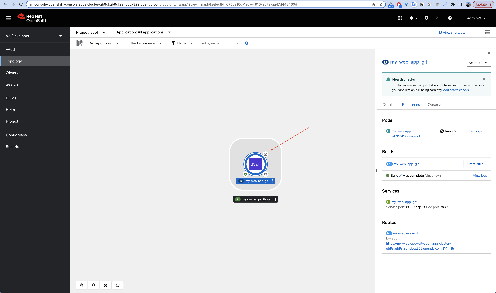
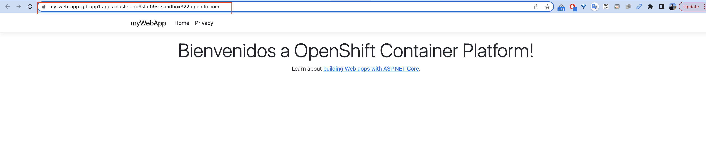

# Crear una aplicacion .net basica para OpenShift

## Pre requisitos

Previamente se debe tener instalado .NET SDK sobre su maquina local, en mi caso lo tengo instalado con brew sobre el MAC
```
[jmanuelcalvo@Joses-MacBook-Pro myWebApp]$ dotnet --version
7.0.100
```


## Crear una aplicación web .Net de ejemplo Hello World

Lo primero es llevar el codigo hacia un repositorio con git


Una vez creado el repositorio vacio, se debe clonar en la maquina local para empezar a escribir el codigo fuente



```
[jmanuelcalvo@Joses-MacBook-Pro ~]$ git clone https://github.com/jmanuelcalvo/myWebApp.git
Cloning into 'myWebApp'...
remote: Enumerating objects: 3, done.
remote: Counting objects: 100% (3/3), done.
remote: Total 3 (delta 0), reused 0 (delta 0), pack-reused 0
Receiving objects: 100% (3/3), done.
```

Ahora vamos a crear nuestra aplicación .Net de ejemplo. Elige un directorio donde quieras guardar tu aplicación de ejemplo.

```
[jmanuelcalvo@Joses-MacBook-Pro ~]$ cd myWebApp

[jmanuelcalvo@Joses-MacBook-Pro myWebApp]$ dotnet new webapp
The template "ASP.NET Core Web App" was created successfully.
This template contains technologies from parties other than Microsoft, see https://aka.ms/aspnetcore/7.0-third-party-notices for details.

Processing post-creation actions...
Restoring /Users/jmanuelcalvo/myWebApp/myWebApp.csproj:
  Determining projects to restore...
  Restored /Users/jmanuelcalvo/myWebApp/myWebApp.csproj (in 128 ms).
Restore succeeded.
```

Una vez creada la base de la aplicacion, se puede realizar una prueba de ejecucion local
```
[jmanuelcalvo@Joses-MacBook-Pro myWebApp]$ dotnet run
Building...
info: Microsoft.Hosting.Lifetime[14]
      Now listening on: http://localhost:5241
info: Microsoft.Hosting.Lifetime[0]
      Application started. Press Ctrl+C to shut down.
info: Microsoft.Hosting.Lifetime[0]
      Hosting environment: Development
info: Microsoft.Hosting.Lifetime[0]
      Content root path: /Users/jmanuelcalvo/myWebApp
```

En la ejecucion del comando se puede visualizar que la app se desplego en la maquina local y se puede probar a traves de http://localhost:5241


Modificar el código .Net

```
[jmanuelcalvo@Joses-MacBook-Pro myWebApp]$ cd Pages/
[jmanuelcalvo@Joses-MacBook-Pro Pages]$ vim Index.cshtml
```
y cambiar las lineas

```
<h1 class="display-4">Welcome</h1>
```

por
```
<h1 class="display-4">Bienvenidos a OpenShift Container Platform!</h1>
```

```
[jmanuelcalvo@Joses-MacBook-Pro Pages]$ vim Index.cshtml
@page
@model IndexModel
@{
    ViewData["Title"] = "Home page";
}

<div class="text-center">
    <h1 class="display-4">Bienvenidos a OpenShift Container Platform!</h1>
    <p>Learn about <a href="https://docs.microsoft.com/aspnet/core">building Web apps with ASP.NET Core</a>.</p>
</div>
```

y realizar pruebas nuevamente para evidenciar los cambios

```
[jmanuelcalvo@Joses-MacBook-Pro Pages]$ cd ../
[jmanuelcalvo@Joses-MacBook-Pro myWebApp]$ dotnet run
Building...
info: Microsoft.Hosting.Lifetime[14]
      Now listening on: http://localhost:5241
info: Microsoft.Hosting.Lifetime[0]
      Application started. Press Ctrl+C to shut down.
info: Microsoft.Hosting.Lifetime[0]
      Hosting environment: Development
info: Microsoft.Hosting.Lifetime[0]
      Content root path: /Users/jmanuelcalvo/myWebApp

```


Preparar la aplicación para OpenShift
Utilice el siguiente comando para preparar la aplicación .Net para el proceso de creación y despliegue en OpenShift. El comando dotnet publish prepara la aplicación para su despliegue almacenando los artefactos en una carpeta. El parámetro -c define la configuración de compilación.

```
[jmanuelcalvo@Joses-MacBook-Pro ~]$ dotnet publish myWebApp  -c Release
MSBuild version 17.4.0+18d5aef85 for .NET
  Determining projects to restore...
  All projects are up-to-date for restore.
  myWebApp -> /Users/jmanuelcalvo/myWebApp/bin/Release/net7.0/myWebApp.dll
  myWebApp -> /Users/jmanuelcalvo/myWebApp/bin/Release/net7.0/publish/
```


## Llevar la aplicacion myWebApp a OpenShift

Lo primero es llevar el codigo hacia un repositorio con git previamente creado, para ellos se deben ejecutar los comandos:
```
[jmanuelcalvo@Joses-MacBook-Pro myWebApp]$ git add .
[jmanuelcalvo@Joses-MacBook-Pro myWebApp]$ git commit -m ".net inicial"
[main 401aca0] .net inicial
 226 files changed, 155189 insertions(+)
 create mode 100644 Pages/Error.cshtml
 create mode 100644 Pages/Error.cshtml.cs
 create mode 100644 Pages/Index.cshtml
 create mode 100644 Pages/Index.cshtml.cs
...
...
 create mode 100644 wwwroot/lib/jquery/dist/jquery.min.js
 create mode 100644 wwwroot/lib/jquery/dist/jquery.min.map

[jmanuelcalvo@Joses-MacBook-Pro myWebApp]$ git push
Enumerating objects: 165, done.
Counting objects: 100% (165/165), done.
Delta compression using up to 12 threads
Compressing objects: 100% (145/145), done.
Writing objects: 100% (164/164), 1.02 MiB | 3.11 MiB/s, done.
Total 164 (delta 48), reused 0 (delta 0), pack-reused 0
remote: Resolving deltas: 100% (48/48), done.
To https://github.com/jmanuelcalvo/myWebApp.git
   2338285..401aca0  main -> main
```

El repositorio debe quedar actualizado y con el codigo fuente de la aplicacion




Dentro de la interfase de Desarrollador de OpenShift realizar los siguientes pasos

Add -> Import from Git y tomar el URL del git


Al poner el url del repositorio, OpenShift identifica cual es el framework sobre el cual esta desarrollado el codigo de forma automatica


Finalmente click en el boton de Create y esperar hasta que el contenedor se despliegue



Una vez la aplicacion desplegada sobre OpenShift, dar click en el icono de la ruta para visutalizar la aplicacion



Identifique que el URL de publicacion es el que hace referencia a OpenShift


Basado en el laboratorio

https://cloud.redhat.com/blog/run-.net-code-on-red-hat-openshift-container-platform-on-mac-os

