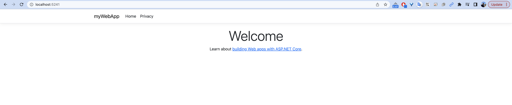
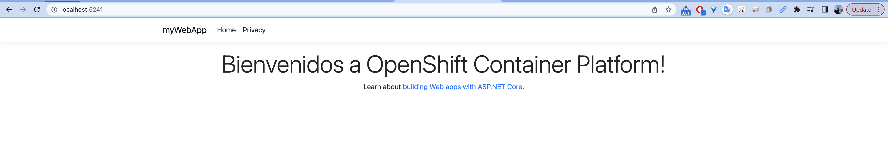

# Crear una aplicacion .net basica para OpenShift

## Pre requisitos

Previamente se debe tener instalado .NET SDK sobre su maquina local, en mi caso lo tengo instalado con brew sobre el MAC
```
[jmanuelcalvo@Joses-MacBook-Pro myWebApp]$ dotnet --version
7.0.100
```


## Crear una aplicación web .Net de ejemplo Hello World
Ahora vamos a crear nuestra aplicación .Net de ejemplo. Elige un directorio donde quieras guardar tu aplicación de ejemplo.

```
[jmanuelcalvo@Joses-MacBook-Pro ~]$ mkdir myWebApp
[jmanuelcalvo@Joses-MacBook-Pro ~]$ cd myWebApp

[jmanuelcalvo@Joses-MacBook-Pro myWebApp]$ dotnet new webapp
The template "ASP.NET Core Web App" was created successfully.
This template contains technologies from parties other than Microsoft, see https://aka.ms/aspnetcore/7.0-third-party-notices for details.

Processing post-creation actions...
Restoring /Users/jmanuelcalvo/myWebApp/myWebApp.csproj:
  Determining projects to restore...
  Restored /Users/jmanuelcalvo/myWebApp/myWebApp.csproj (in 128 ms).
Restore succeeded.
```

Una vez creada la base de la aplicacion, se puede realizar una prueba de ejecucion local
```
[jmanuelcalvo@Joses-MacBook-Pro myWebApp]$ dotnet run
Building...
info: Microsoft.Hosting.Lifetime[14]
      Now listening on: http://localhost:5241
info: Microsoft.Hosting.Lifetime[0]
      Application started. Press Ctrl+C to shut down.
info: Microsoft.Hosting.Lifetime[0]
      Hosting environment: Development
info: Microsoft.Hosting.Lifetime[0]
      Content root path: /Users/jmanuelcalvo/myWebApp
```

En la ejecucion del comando se puede visualizar que la app se desplego en la maquina local y se puede probar a traves de http://localhost:5241




Modificar el código .Net

```
[jmanuelcalvo@Joses-MacBook-Pro myWebApp]$ cd Pages/
[jmanuelcalvo@Joses-MacBook-Pro Pages]$ vim Index.cshtml
```
y cambiar las lineas

```
<h1 class="display-4">Welcome</h1>
```

por
```
<h1 class="display-4">Bienvenidos a OpenShift Container Platform!</h1>
```

```
[jmanuelcalvo@Joses-MacBook-Pro Pages]$ vim Index.cshtml
@page
@model IndexModel
@{
    ViewData["Title"] = "Home page";
}

<div class="text-center">
    <h1 class="display-4">Bienvenidos a OpenShift Container Platform!</h1>
    <p>Learn about <a href="https://docs.microsoft.com/aspnet/core">building Web apps with ASP.NET Core</a>.</p>
</div>
```

y realizar pruebas nuevamente para evidenciar los cambios

```
[jmanuelcalvo@Joses-MacBook-Pro Pages]$ cd ../
[jmanuelcalvo@Joses-MacBook-Pro myWebApp]$ dotnet run
Building...
info: Microsoft.Hosting.Lifetime[14]
      Now listening on: http://localhost:5241
info: Microsoft.Hosting.Lifetime[0]
      Application started. Press Ctrl+C to shut down.
info: Microsoft.Hosting.Lifetime[0]
      Hosting environment: Development
info: Microsoft.Hosting.Lifetime[0]
      Content root path: /Users/jmanuelcalvo/myWebApp

```



# Laboratorios
[Taller 1](talleresd/taller1.md) - Despliegue de aplicaciones desde Docker y s2i

[Taller 2](talleresd/taller2.md) - Uso de repositorios GIT

[Taller 3](talleresd/taller3.md) - Configuracion de limites y quotas en los pods

[Taller 4](talleresd/taller4.md) - Configuracion de Rutas - Estrategias de despliegues avanzadas

[Taller 5](talleresd/taller5.md) - Monitoreo y Logs

