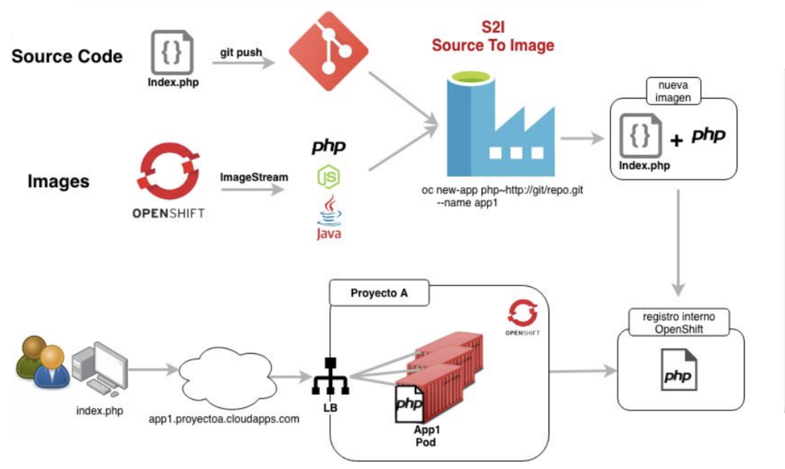

# Crear una imagen base S2I (Source to Image) para ejecutarse en OpenShift

Source-to-Image (S2I) is una conjunto de herramientas y un flujo de trabajo para construir imagenes de contenedor que permiten la inyeccion dinamica de codigo fuente dentro de un contenedor al momento de su ejecucion creando un contenedor auto-ensamblado

OpenShift cuenta con multiples imagenes de tipo S2I con los princiales lenguajes de programacion, en algunos casos se utiliza una imagen personalizada por el cliente en los casos en que se desaa que la base S2I contenga algo mas que solo el lenguaje o el framework instalado, para este procedimiento tenga en cuenta los siguientes pasos:





1. En Red Hat / CentOS instale habilite el repositiorio s2i
**Red Hat**
Habilitar el repositorio rhel-server-rhscl-7-rpms

**CentOS**
Instalar los paquetes
```
[root@centos ~]# yum install centos-release-scl
[root@centos ~]# yum install source-to-image
```

2. Ingrese a la terminal de la maquina bastion con su usuario de terminal
```
[localhost ~]$ ssh user0X@bastion.2775.example.opentlc.com
```

3. Cree la estrucrtura de datos de S2I (source to image)
s2i create image_name directory
```
[user0X@bastion ~]$ s2i create s2i-test0X s2i-test0X/
```
**NOTA** La estructura que se crea con S2I la carpeta bin no cuenta con permisos de ejecucion, por lo que muy probablemente haga que la imagen **FALLE** al momento de ejecutar el comando **run** no por el comando si no por los permisos de la carpeta

```
[user19@bastion ~]$ chmod  -R 775 s2i-test0X/.s2i/bin/ 
```

4. Valide los archivos creados por el comando S2I
```
[user19@bastion ~]$ cd s2i-test0X/
[user19@bastion s2i-test0X]$ tree -ar
.
|-- Dockerfile
|-- Makefile
|-- README.md
|-- .s2i
|   -- bin
|       |-- assemble
|       |-- run
|       |-- save-artifacts
|       `-- usage
`-- test
    |-- run
    -- test-app
        -- index.html
4 directories, 10 files
```

El archivo Dockerfile contiene al igual que en Docker los parametros de instalacion de las aplicaciones

Deje el contenido del archivo Dockerfile similar al siguiente:

```
[user19@bastion s2i-test0X]$ vim Dockerfile
FROM centos:centos7

RUN rpmkeys --import file:///etc/pki/rpm-gpg/RPM-GPG-KEY-CentOS-7 && \
    yum install -y centos-release-scl scl-utils && \
    PACKAGES="httpd24 httpd24-httpd-devel httpd24-mod_auth_kerb httpd24-mod_ldap httpd24-mod_session rsync" && \
    yum install -y --setopt=tsflags=nodocs --enablerepo=centosplus ${PACKAGES} && \
    rpm -V ${PACKAGES} && \
    yum clean all -y

# Cree una cuenta no root llamada 'default' para ser el propietario de todos
# los archivos que guardara el servidor httpd de Apache. Esta cuenta debe estar
# en el grupo 'root' (gid = 0) ya que ese es el grupo que usaria el servidor
# httpd de Apache si el contenedor se ejecuta más tarde con una ID de usuario
# unica que no está presente en la base de datos de la cuenta del host

ENV HOME=/opt/app-root

RUN mkdir -p ${HOME} && \
    useradd -u 1001 -r -g 0 -d ${HOME} -s /sbin/nologin \
            -c "Default Application User" default

# Modifique la configuración predeterminada de Apache para escuchar en un puerto no privilegiado
# (predeterminado en 8080) y registre todo en stdout / stderr. También incluya un archivo de
# configuración propio para que podamos anular otra configuración

ENV PORT=8080

RUN mkdir -p ${HOME}/htdocs && \
    sed -ri -e 's/^Listen 80$/Listen ${PORT}/' \
            -e 's%"logs/access_log"%"/proc/self/fd/1"%' \
            -e 's%"logs/error_log"%"/proc/self/fd/2"%' \
            /opt/rh/httpd24/root/etc/httpd/conf/httpd.conf && \
    echo "Include ${HOME}/httpd.conf" >> /opt/rh/httpd24/root/etc/httpd/conf/httpd.conf

COPY httpd.conf ${HOME}/httpd.conf

EXPOSE ${PORT}

# Copie en su lugar los scripts del generador de S2I, el script de ejecución y etiquete
# la imagen de Docker para que el software 's2i' sepa dónde encontrarlos.

COPY ./.s2i/ ${HOME}/s2i
COPY run ${HOME}/run

LABEL io.k8s.description="S2I builder for hosting files with Apache HTTPD server" \
      io.k8s.display-name="Apache HTTPD Server" \
      io.openshift.expose-services="8080:http" \
      io.openshift.tags="builder,httpd" \
      io.openshift.s2i.scripts-url="image://${HOME}/s2i/bin"

# Repare todos los directorios de la cuenta para que puedan escribirse en grupo en el grupo
# 'root' (gid = 0) para que puedan actualizarse si es necesario,
# como ocurriría si se usa 'oc rsync' para copiar archivos en un contenedor.

RUN chown -R 1001:0 /opt/app-root && \
    find ${HOME} -type d -exec chmod g+ws {} \;

# Asegurese de que el contenedor se ejecute como una cuenta no root desde su directorio de inicio.

WORKDIR ${HOME}

USER 1001

#Configure el servidor httpd de Apache para que se ejecute cuando se ejecute el contenedor

CMD [ "/opt/app-root/run" ]
```
Observe con detalle los valores de ***LABEL*** y ***COPY***

Tenga en cuenta tambien que en el ejemplo se esta adicionando un archivo llamado  httpd.conf el cual contiene la configuracion del servicio de apache, (definicio de puertos y usuario con quien se ejecutara el servicio)

Observe tambien que se esta adicionando ***ADD*** un archivo **httpd.conf** el cual los parametros de configuracion del apache con el nuevo usuario y puerto de ejecucion

Cree el archivo httpd.conf con el siguiente contenido


```
[user19@bastion s2i-test0X]$ vim httpd.conf
DefaultRuntimeDir ${HOME}

PidFile ${HOME}/httpd.pid

DocumentRoot /opt/app-root/htdocs

<Directory /opt/app-root/htdocs>
    AllowOverride FileInfo AuthConfig Limit Indexes
    Options MultiViews Indexes SymLinksIfOwnerMatch IncludesNoExec
    Require method GET POST OPTIONS
</Directory>
```

## Scripts de S2I

La construccion de imagenes con s2i cuenta con 3 scripts especiales que son:

**.s2i/bin/assemble** Este script se encarga de inyectar los datos desde una fuente a una ruta especifica del contenedor

```
[user19@bastion s2i-test0X]$ vim .s2i/bin/assemble
#!/bin/bash

set -eo pipefail

echo "---> Copying source files"

rm -rf /tmp/src/.git*
rm -rf /tmp/src/.s2i*

cp -Rf /tmp/src/. /opt/app-root/htdocs/

rm -rf /tmp/src

echo "---> Fix permissions on source files"

chmod -Rf g+w /opt/app-root/htdocs || true
````

**NOTA** Presete especial atencion a la linea que realiza el copiado de la informacion a la carpeta de datos del apache **/opt/app-root/htdocs/**


Cuando esta imagen es utilizada en OpenShift el git clone con el codigo fuente es descargado en un contenedor temporal en la carpeta /tmp/src/ y enviado al contendor definitivo a la carpeta /opt/app-root/htdocs/


**.s2i/bin/run** Este script es llamado de forma automatica una vez la imagen sea ejecutada como contenedor, este script es quien debe inciar el servicio, similar al CMD dentro del los archivos Dockerfile

```
[user19@bastion s2i-test0X]$ cat .s2i/bin/run
#!/bin/bash

set -eo pipefail

exec ${HOME}/run
```
Este script se encarga de que cuando el contenedor inicie, llame al siguiente script que cuenta con la linea de inicio de apache, Este doble llamado de script de inicio sucede por que es necesario que el contenedor una vez este en ejecucion cargue unas variables de la libreria de SCL y luego ejecute el apache.

Cree el script run que iniciara el servicio

```
[user19@bastion s2i-test0X]$ cat run
#!/bin/bash

# Enable SCL Apache HTTPD server package.

source scl_source enable httpd24

# Ensure we run the Apache HTTPD server as process ID 1 and in foreground.

exec httpd -DFOREGROUND
```

Indique cual es el comando de inicio de servicio de http

***Makefile*** El archivo make contiene los comandos relacionados con el docker build, por lo que para la compilacion de la imagen puede usar el comando docker build usado en los talleres de docker o simplemente ejecutar el comando make

```
IMAGE_NAME = s2i-test0X

build:
	docker build -t $(IMAGE_NAME) .

.PHONY: test
test:
	docker build -t $(IMAGE_NAME)-candidate .
	IMAGE_NAME=$(IMAGE_NAME)-candidate test/run
```  


5. Compilacion de la imagen.
Dentro de la carpeta s2i-test0X ejecute el comando **make**

```
[user19@bastion s2i-test0X]$ make
docker build -t s2i-test0X .
Sending build context to Docker daemon 17.92 kB
Step 1/15 : FROM centos:centos7
 ---> 5e35e350aded
Step 2/15 : RUN rpmkeys --import file:///etc/pki/rpm-gpg/RPM-GPG-KEY-CentOS-7 &&     yum install -y centos-release-scl scl-utils &&     PACKAGES="httpd24 httpd24-httpd-devel httpd24-mod_auth_kerb httpd24-mod_ldap httpd24-mod_session rsync" &&     yum install -y --setopt=tsflags=nodocs --enablerepo=centosplus ${PACKAGES} &&     rpm -V ${PACKAGES} &&     yum clean all -y
 ---> Using cache
 ---> 9080a5790817
...
...
...
Step 14/15 : USER 1001
 ---> Using cache
 ---> 2385c284ff0f
Step 15/15 : CMD /opt/app-root/run
 ---> Using cache
 ---> ae1742965d74
Successfully built ae1742965d74
```

Este comando genera una nueva imagen de Docker


```
[user19@bastion s2i-test0X]$ docker images
REPOSITORY                                                                     TAG                 IMAGE ID            CREATED              SIZE
s2i-test0X                                                                     latest              026a39defc60        About a minute ago   260 MB
```


6. Realizacion de pruebas locales de inyectar codigo a la nueva imagen.

```
[user0X@bastion s2i-test0X]$ echo "Codigo" > test/test-app/index.html
[user19@bastion s2i-test0X]$ s2i build test/test-app s2i-test0X s2i-test0X
I1217 13:54:35.910867 00892 install.go:251] Using "assemble" installed from "image:///opt/app-root/s2i/bin/assemble"
I1217 13:54:35.910970 00892 install.go:251] Using "run" installed from "image:///opt/app-root/s2i/bin/run"
I1217 13:54:35.910991 00892 install.go:251] Using "save-artifacts" installed from "image:///opt/app-root/s2i/bin/save-artifacts"
---> Copying source files
---> Fix permissions on source files
```
Ejecutar el contenedor y validar por dentro el codigo
```
[user0X@bastion s2i-test]$ docker run -it -p 80XX:8080 s2i-test0X bash
bash-4.2$ pwd
/opt/app-root
bash-4.2$ ls
htdocs	httpd.conf  run  s2i
bash-4.2$ cat htdocs/index.html
Codigo
bash-4.2$ exit
```

7. En caso que la imagen s2i funcione de acuerdo a lo esperado, los siguientes pasos seran, cargarla al repositorio de docker para posteriormente ser cargada como imagen base a openshift


```
[user19@bastion s2i-test0X]$ docker tag s2i-test0X docker.io/jmanuelcalvo/s2i-test0X:latest
```
Recuerde estar logueado en Docker
```
[user19@bastion s2i-test0X]$ docker login docker.io
Login with your Docker ID to push and pull images from Docker Hub. If you don't have a Docker ID, head over to https://hub.docker.com to create one.
Username: jmanuelcalvo
Password:
Login Succeeded
[user19@bastion s2i-test0X]$ docker push docker.io/jmanuelcalvo/s2i-test0X:latest
The push refers to a repository [docker.io/jmanuelcalvo/s2i-test0X]
737b54fff43f: Pushed
d72a99aa43e7: Pushed
4dc0b923d868: Pushed
a255d8ff5a53: Pushed
adfdc6f3d57b: Pushed
77b174a6a187: Pushed
latest: digest: sha256:ab51e7fab4ec641f54a1973ead0495606f276799e0a6a5fdec3cab3370da0b35 size: 1570
```
8. Importar la imagen a OpenShift
Garantice que este logueado sobre OpenShift y sobre el proyecto que desea importar dicha imagen.

**NOTA:** Recuerde que en caso de querer que la imagen sea visualizada por todos los proyectos y usuarios de OpenShift, la imagen se debe importar en el  proyecto/namespace openshift.

```
[root@bastion ~]$ oc login -u user0X https://loadbalancer.2775.internal:443

[user0X@bastion ~]$ oc whoami
user19

[user19@bastion s2i-test0X]$ oc new-project s2i-test0X
Now using project "s2i-test0X" on server "https://loadbalancer.2775.internal:443".

You can add applications to this project with the 'new-app' command. For example, try:

    oc new-app centos/ruby-25-centos7~https://github.com/sclorg/ruby-ex.git

to build a new example application in Ruby.

[user19@bastion s2i-test0X]$ oc import-image s2i-test0X --from docker.io/jmanuelcalvo/s2i-test0X:latest --confirm --insecure=true
imagestream.image.openshift.io/s2i-test0X imported

[user19@bastion s2i-test0X]$ oc get is
NAME         DOCKER REPO                                              TAGS      UPDATED
s2i-test0X   docker-registry.default.svc:5000/s2i-test0X/s2i-test0X   latest    25 seconds ago
```

9. Por ultimo cree una aplicacion utilizando su nueva imagen

```
[user0X@bastion ~]$ oc new-app s2i-test0X~https://github.com/jmanuelcalvo/app.git --name=app0X
```
