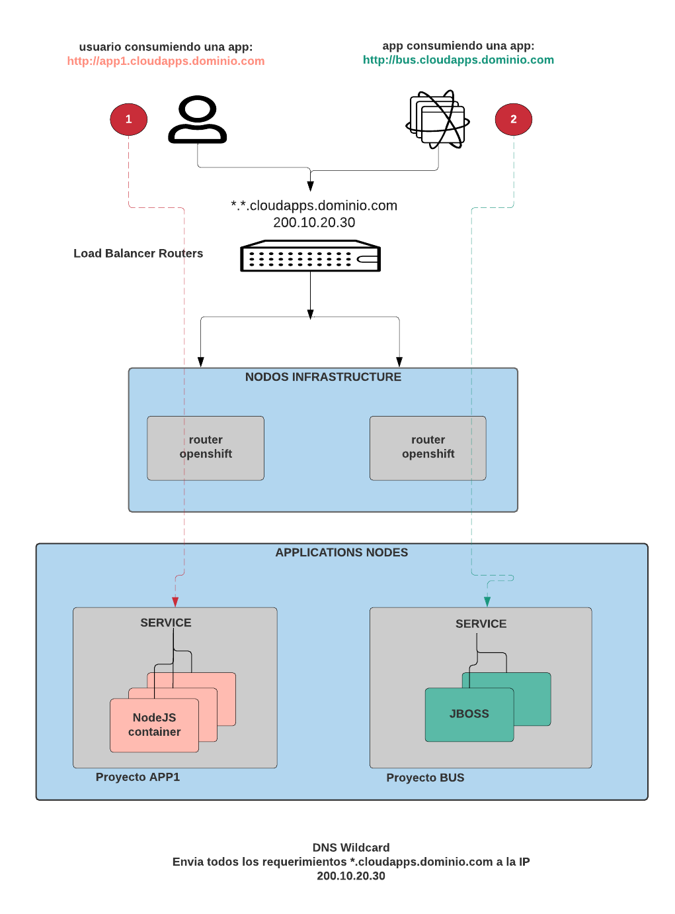

# Talleres
[Inicio](../Inicio.md)

# Teoria
# Recursos de OpenShift
```
Projects
Pods
Services | svc
Routes
Secrets
ConfigMap
ImageStream | is
Templates
PersistentVolume | pv
PersistentVolumeClaim | pvc
DeploymentConfig | dc
BuildConfig | bc
Replication Controller | rc
nodes				# cluster admin command
users				# cluster admin command
```

# Comandos de inicio de OCP
```
oc types		     # Descripcion de los recursos de OpenShift
oc login [<cluster>]         # Loguearse a un cluster de OpenShift
oc list project              # Listar proyectos
oc project <project>         # Cambiarse entre proyectos
oc new-project <project>     # Crear proyectos
oc status		     # Estatus de login, proyecto actual
oc whoami -t                 # Obtener los datos del usuario con el que esta conectado
oc logout		     # Desloguearse de un cluster de OpenShift
oc delete project	     # Elimiar un proyecto y todo sus recursos
```

## Ejemplos
```
oc login https://loadbalancer.$GUID.internal:443 -u user40 -p redhat01
oc new-project myapp
oc project myapp
oc delete project myapp
```

# Creacion y eliminar de aplicaciones en OpenShift basadas en:
```
oc new-app -S php
oc new-app -S --template=ruby 		  # Plantillas de OCP
oc new-app -S --image-stream=mysql	# Imagenes cargadas previamente en el servidor de registro de OCP
oc new-app -S --docker-image=python	# Imagenes de un servidor de registro de Docker
```
## Ejemplos

OpenShift se encarga de conocer el lenguaje de programacion que se encuentra en el repo git y selecciona la imagen (is) requerida ej: php, ruby, java
```
oc new-app https://github.com/jmanuelcalvo/app.git --name=app1

Se indica la imagen (is) especifica (centos/ruby-25-centos7) a utilizar y la fuente del codigo en un repositorio git
oc new-app centos/ruby-25-centos7~https://github.com/sclorg/ruby-ex.git

Se utiliza la imagen (is) de MySQL y se le pasan los parametros como variables
oc new-app mysql MYSQL_USER=user MYSQL_PASSWORD=pass MYSQL_DATABASE=testdb -l db=mysql
oc new-app mysql:5.6 --name=mysql -e MYSQL_USER=user1 -e MYSQL_PASSWORD=mypa55 -e MYSQL_ROOT_PASSWORD=r00tpa55 -e MYSQL_DATABASE=testdb

Se utiliza una imagen de docker a partir de servidor de registro externo
oc new-app --docker-image=myregistry.com/mycompany/mysql --name=private

Se crea un archivo en formato yaml con la definicion de todos los recursos y se crea la app a partir del mismo
oc create -f app.yml

Elimina todos los recursos creados con el label app1
oc delete all -l app=app1

Elimina todos los recursos dentro del proyecto (menos el proyecto)
oc delete all --all
```

# Obtener informacion de OpenShift
Argumentos del comando OC para obtener detalles de los recursos
```
get
export
describe
edit

NOTA: Puede obtener la ayuda de cualquier comando con el parametro -h asi:
oc project -h
oc new-app -h
oc delete -h
oc get -h

y se pueden usar con la mayoria de recursos componiendo el comando de la siguiente forma:
```
## Ejemplos
```
oc get pod
oc get pod -o wide 		# Informacion adicional de los pod
oc get service
oc describe pod php-5fs4
oc describe service php
oc edit svc php			# Los svcs pueden ser accedidos por FQDN dentro del mismo proyecto a traves del SVC_NAME.PROJECT_NAME.svc.cluster.local
oc export svc,dc -l name=php
```


# Comandos para solucionar problemas
```
oc debug
oc logs
oc exec
oc get ev
oc rsh
oc describe
oc rsync
oc delete
oc port-forwaed
```

## Ejemplos
```
oc debug dc/test
$ oc debug dc/test -o yaml
oc logs -f <pod>	| 	oc logs -f php-5fs4
oc exec <pod> [-c <container>] <command> | oc exec php-5fs4 ps xa
oc rsh <pod> |	oc rsh php-5fs4
oc rsync <local_dir> <pod>:<pod_dir> -c <container>
oc rsync <pod>:<pod_dir> <local_dir> -c <container>
oc port-forward <pod> <local_port>:<remote_port>
oc port-forward  mysql-1-t3qfb 13306:3306	| 	mysql -h127.0.0.1 -P13306 -uuser1 -pmypa55
```


# Taller No 1.

Tenga en cuenta que para los ejercicios, debe cambiar el nombre del usuario user0X por el que le fue asignado

# Ejecute los siguientes comandos:
1. Verifique con que usuario se encuentre logueado
```
[user01@bastion ~]$ oc whoami
user01
```
2. En caso que no este logueado, loguese con su usuario (contraseña redhat01)
```
[user01@bastion ~]$  oc login https://loadbalancer.2775.example.opentlc.com -u user0X
```
3. Cree un nuevo proyecto
```
[user01@bastion ~]$ oc new-project project0X
- Now using project "project01" on server "https://loadbalancer.2775.internal:443".

You can add applications to this project with the 'new-app' command. For example, try:

    oc new-app centos/ruby-25-centos7~https://github.com/sclorg/ruby-ex.git

to build a new example application in Ruby.
```
4. Cree una nueva aplicacion utilizando la metodologia s2i de donde el source es un repo git y la image es php
```
[user01@bastion ~]$ oc new-app php~https://github.com/jmanuelcalvo/app.git --name=app0X
--> Found image ab2fbc4 (13 days old) in image stream "openshift/php" under tag "7.1" for "php"

    Apache 2.4 with PHP 7.1
    -----------------------
    PHP 7.1 available as container is a base platform for building and running various PHP 7.1 applications and frameworks. PHP is an HTML-embedded scripting language. PHP attempts to make it easy for developers to write dynamically generated web pages. PHP also offers built-in database integration for several commercial and non-commercial database management systems, so writing a database-enabled webpage with PHP is fairly simple. The most common use of PHP coding is probably as a replacement for CGI scripts.

    Tags: builder, php, php71, rh-php71

    * A source build using source code from https://github.com/jmanuelcalvo/app.git will be created
      * The resulting image will be pushed to image stream tag "app01:latest"
      * Use 'start-build' to trigger a new build
    * This image will be deployed in deployment config "app01"
    * Ports 8080/tcp, 8443/tcp will be load balanced by service "app01"
      * Other containers can access this service through the hostname "app01"

--> Creating resources ...
    imagestream.image.openshift.io "app01" created
    buildconfig.build.openshift.io "app01" created
    deploymentconfig.apps.openshift.io "app01" created
    service "app01" created
--> Success
    Build scheduled, use 'oc logs -f bc/app01' to track its progress.
    Application is not exposed. You can expose services to the outside world by executing one or more of the commands below:
     'oc expose svc/app01'
    Run 'oc status' to view your app.
```

5. Ejecute los siguientes comandos de verificacion e identifique los nombres de los recursos
```
oc get pod
oc get service
oc get all
oc get route
oc get dc
oc get bc
```
Ejemplos
```
[user01@bastion ~]$ oc get pod
NAME            READY     STATUS      RESTARTS   AGE
app01-1-build   0/1       Completed   0          4m
app01-1-tdbdn   1/1       Running     0          3m

[user01@bastion ~]$ oc get service
NAME      TYPE        CLUSTER-IP     EXTERNAL-IP   PORT(S)             AGE
app01     ClusterIP   172.30.0.109   <none>        8080/TCP,8443/TCP   5m
```
6. Ejecute los siguientes comandos de obtener informacion adicionar de los anteriores recursos
```
oc describe pod
oc describe service
oc describe route
oc describe dc
oc describe bc
```
Ejemplos
```
[user01@bastion ~]$ oc describe pod app01-1-tdbdn
Name:               app01-1-tdbdn
Namespace:          project01
Priority:           0
PriorityClassName:  <none>
Node:               node3.1b84.internal/192.168.0.95
Start Time:         Tue, 29 Oct 2019 00:33:46 +0000
Labels:             app=app01
                    deployment=app01-1
                    deploymentconfig=app01
Annotations:        openshift.io/deployment-config.latest-version=1
                    openshift.io/deployment-config.name=app01
                    openshift.io/deployment.name=app01-1
                    openshift.io/generated-by=OpenShiftNewApp
                    openshift.io/scc=restricted
Status:             Running
IP:                 10.1.10.114
Controlled By:      ReplicationController/app01-1
Containers:
  app01:
    Container ID:   docker://b000c04474c8d9541e38991ced0c47752fd6303d2f11744c29929be100f4705f
    Image:          docker-registry.default.svc:5000/project01/app01@sha256:62a685552a2c1e35118de9512e46ceb4b3d1b873fbf678400c1a8eebf8190a7e
    Image ID:       docker-pullable://docker-registry.default.svc:5000/project01/app01@sha256:62a685552a2c1e35118de9512e46ceb4b3d1b873fbf678400c1a8eebf8190a7e
    Ports:          8080/TCP, 8443/TCP
    Host Ports:     0/TCP, 0/TCP
    State:          Running
      Started:      Tue, 29 Oct 2019 00:33:48 +0000
    Ready:          True
    Restart Count:  0
    Environment:    <none>
    Mounts:
      /var/run/secrets/kubernetes.io/serviceaccount from default-token-m96bz (ro)
Conditions:
  Type              Status
  Initialized       True
  Ready             True
  ContainersReady   True
  PodScheduled      True
Volumes:
  default-token-m96bz:
    Type:        Secret (a volume populated by a Secret)
    SecretName:  default-token-m96bz
    Optional:    false
QoS Class:       BestEffort
Node-Selectors:  node-role.kubernetes.io/compute=true
Tolerations:     <none>
Events:
  Type    Reason     Age   From                          Message
  ----    ------     ----  ----                          -------
  Normal  Scheduled  5m    default-scheduler             Successfully assigned project01/app01-1-tdbdn to node3.1b84.internal
  Normal  Pulling    5m    kubelet, node3.1b84.internal  pulling image "docker-registry.default.svc:5000/project01/app01@sha256:62a685552a2c1e35118de9512e46ceb4b3d1b873fbf678400c1a8eebf8190a7e"
  Normal  Pulled     5m    kubelet, node3.1b84.internal  Successfully pulled image "docker-registry.default.svc:5000/project01/app01@sha256:62a685552a2c1e35118de9512e46ceb4b3d1b873fbf678400c1a8eebf8190a7e"
  Normal  Created    5m    kubelet, node3.1b84.internal  Created container
  Normal  Started    5m    kubelet, node3.1b84.internal  Started container
```
  
7. Publique la aplicacion que acaba de crear


- Valide si se encuentra la ruta (router creado)
```
[user01@bastion ~]$ oc get route
No resources found.
```
- En caso que no, verificar el nombre del servicio a exponer
```
[user01@bastion ~]$ oc get svc
NAME      TYPE        CLUSTER-IP     EXTERNAL-IP   PORT(S)             AGE
app01     ClusterIP   172.30.0.109   <none>        8080/TCP,8443/TCP   7m

[user01@bastion ~]$ oc expose  svc app01
route.route.openshift.io/app01 exposed
```
- Validar nuevamente el nombre de la ruta
```
[user01@bastion ~]$ oc get route
NAME      HOST/PORT                                       PATH      SERVICES   PORT       TERMINATION   WILDCARD
app01     app01-project01.apps.1b84.example.opentlc.com             app01      8080-tcp                 None
```
- Una vez se conozca el nombre de la ruta, ingresar por el navegador web o desde el comando cURL
```
[user01@bastion ~]$ curl http://app01-project01.apps.1b84.example.opentlc.com/hostname.php
Esta es la version 1 de la app. Se ejecuta en el host -> app01-1-tdbdn (10.1.10.114)
```

8. Escalar el numero de pods de una aplicacion
```
[user01@bastion ~]$ oc scale --replicas=3 dc app01
deploymentconfig.apps.openshift.io/app01 scaled
```
y validar que el comando curl ahora muestra los 3 IPs diferentes (es probable que en principio solo vea 1 IP, ejecute el comando curl repetidas veces)
```
[user01@bastion ~]$ curl http://app01-project01.apps.2775.example.opentlc.com/hostname.php
Esta es la version 1 de la app. Se ejecuta en el host -> app01-1-tdbdn (10.1.10.114)

[user01@bastion ~]$ curl http://app01-project01.apps.2775.example.opentlc.com/hostname.php
Esta es la version 1 de la app. Se ejecuta en el host -> app01-1-b8gbm (10.1.14.149)
```

9. Por ulitmo eliminar todo e intentar hacer lo mismo por la interfase Web
```
[user01@bastion ~]$ oc delete all --all
pod "app01-1-b8gbm" deleted
pod "app01-1-build" deleted
pod "app01-1-pcg98" deleted
pod "app01-1-tdbdn" deleted
replicationcontroller "app01-1" deleted
service "app01" deleted
deploymentconfig.apps.openshift.io "app01" deleted
buildconfig.build.openshift.io "app01" deleted
imagestream.image.openshift.io "app01" deleted
route.route.openshift.io "app01" deleted
```
