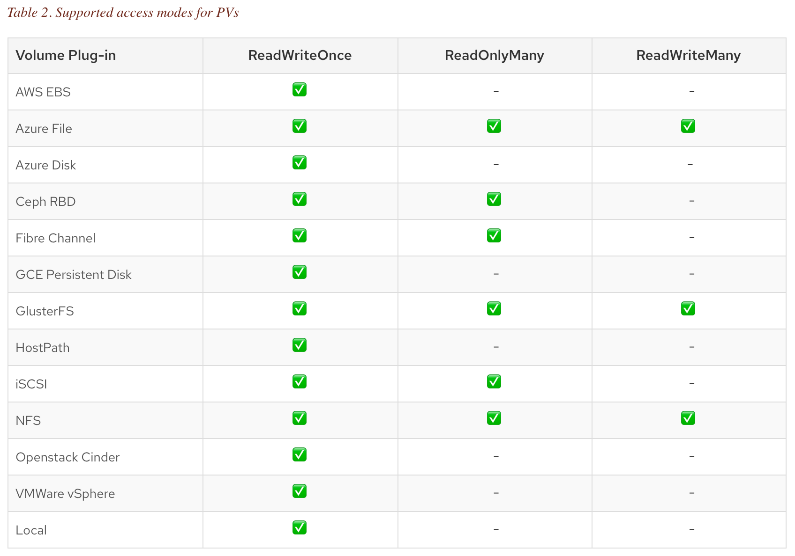

# Talleres
[Inicio](../ComandosOpenShift.md)


# Taller No 2.
Datos persistentes para las aplicaciones

# A traves de Volumenes persistentes:
Los PVC pueden ser de 3 tipos:


| MODO   |      ABREVIATURA      |  DESCRIPCION |
|----------|:-------------:|------:|
| ReadWriteOnce |  RWO | The volume can be mounted as read-write by a single node. |
| ReadOnlyMany |    ROX   |   The volume can be mounted read-only by many nodes. |
| ReadWriteMany | RWX |    The volume can be mounted as read-write by many nodes. |



# Adicionar Volumenn a un pod existente

1. Cree un archivo llamado data01.yml y defina el tipo de almacenamiento 
```
[user01@bastion ~]$ cat << EOF > data01.yml
apiVersion: v1
kind: PersistentVolumeClaim
metadata:
  name: data01
spec:
  accessModes:
  - ReadWriteOnce
  resources:
    requests:
      storage: 5Gi
EOF

```
Verifique el archivo creado
```
[user01@bastion ~]$ cat data01.yml
...
...
```
2. Verifique los Persistent Volume Claim (PVC) creados previamente
```
[user01@bastion ~]$ oc get pvc
NAME      STATUS    VOLUME    CAPACITY   ACCESS MODES   STORAGECLASS   AGE
```
3. Cree el nuevo PVC y verifiquelo
```
[user01@bastion ~]$ oc create -f data01.yml
persistentvolumeclaim/data01 created

[user01@bastion ~]$ oc get pvc
NAME      STATUS    VOLUME    CAPACITY   ACCESS MODES   STORAGECLASS   AGE
data01    Bound     pv7       5Gi        RWO                           2s
```

4. Montar el nuevo PVC sobre un contenedor existente
Asegurese que tenga aplicaciones previamente creadas, en caso de que no, cree una
```
[user01@bastion ~]$ oc new-app php~https://github.com/jmanuelcalvo/app.git --name=app2
[user01@bastion ~]$ oc set volume dc/app2 --add --type=persistentVolumeClaim --claim-name=data01 --mount-path=/data2
```

5. Verificar que el nuevo pod tenga la carpeta montada
```diff
[user01@bastion ~]$ oc get pod
NAME           READY     STATUS      RESTARTS   AGE
app2-1-build   0/1       Completed   0          4h
app2-7-pm5vk   1/1       Running     0          2m

[user01@bastion ~]$ oc rsh  app2-7-pm5vk
sh-4.2$ df -h
Filesystem                                      Size  Used Avail Use% Mounted on
overlay                                          50G  7.5G   43G  15% /
tmpfs                                           3.9G     0  3.9G   0% /dev
tmpfs                                           3.9G     0  3.9G   0% /sys/fs/cgroup
- support1.1b84.internal:/srv/nfs/user-vols/pv7   197G  4.6G  183G   3% /data2
/dev/xvda2                                       50G  7.5G   43G  15% /etc/hosts
shm                                              64M     0   64M   0% /dev/shm
tmpfs                                           3.9G   16K  3.9G   1% /run/secrets/kubernetes.io/serviceaccount
tmpfs                                           3.9G     0  3.9G   0% /proc/acpi
tmpfs                                           3.9G     0  3.9G   0% /proc/scsi
tmpfs                                           3.9G     0  3.9G   0% /sys/firmware
```

# Adicionar Volumenn a una aplicacion nueva

1. Cree un archivo llamado data01.yml y defina el tipo de almacenamiento 
```
[user01@bastion ~]$ cat << EOF > data02.yml
apiVersion: v1
kind: PersistentVolumeClaim
metadata:
  name: data02
spec:
  accessModes:
  - ReadWriteOnce
  resources:
    requests:
      storage: 5Gi
EOF

```
Verifique el archivo creado
```
[user01@bastion ~]$ cat data02.yml
...
...
```
2. Verifique los Persistent Volume Claim (PVC) creados previamente
```
[user01@bastion ~]$ oc get pvc
NAME      STATUS    VOLUME    CAPACITY   ACCESS MODES   STORAGECLASS   AGE
data01    Bound     pv7       5Gi        RWO                           24m
```
3. Cree el nuevo PVC y verifiquelo
```
[user01@bastion ~]$ oc create -f data02.yml
persistentvolumeclaim/data02 created

[user01@bastion ~]$ oc get pvc
NAME      STATUS    VOLUME    CAPACITY   ACCESS MODES   STORAGECLASS   AGE
data01    Bound     pv7       5Gi        RWO                           25m
data02    Bound     pv9       5Gi        RWO                           6s
```

4. Cree un archivo en formato yaml con las siguientes definiciones y presete especial atencion a los parametros que inician por volume
```
[user01@bastion ~]$ cat << EOF > mysql.yml
apiVersion: v1
kind: Service
metadata:
  name: mysql
spec:
  ports:
  - port: 3306
  selector:
    app: mysql
  clusterIP: None
---
apiVersion: apps/v1
kind: Deployment
metadata:
  name: mysql
spec:
  selector:
    matchLabels:
      app: mysql
  strategy:
    type: Recreate
  template:
    metadata:
      labels:
        app: mysql
    spec:
      containers:
      - image: mysql:5.6
        name: mysql
        env:
          # Use secret in real usage
        - name: MYSQL_ROOT_PASSWORD
          value: password
        ports:
        - containerPort: 3306
          name: mysql
        volumeMounts:
        - name: mysql-persistent-storage
          mountPath: /var/lib/mysql
      volumes:
      - name: mysql-persistent-storage
        persistentVolumeClaim:
          claimName: data02
EOF
```
Verfique el archivo creado
```
[user01@bastion ~]$ cat mysql.yml
...
...
```
5. Cree la aplicacion y el servicio a partir del nuevo archivo
```
[user01@bastion ~]$ oc create -f  mysql.yml
service/mysql created
deployment.apps/mysql created
```
6. Verifique que la aplicacion esta corriendo y que tiene el volumen persistente
```diff
[user01@bastion ~]$ oc get pod
  NAME                     READY     STATUS      RESTARTS   AGE
  app2-1-build             0/1       Completed   0          5h
  app2-7-pm5vk             1/1       Running     0          25m
- mysql-685958c648-zftrv   1/1       Running     0          48s

[user01@bastion ~]$ oc rsh mysql-685958c648-zftrv
$ df -h
  Filesystem                                     Size  Used Avail Use% Mounted on
  overlay                                         50G  7.9G   43G  16% /
  tmpfs                                          3.9G     0  3.9G   0% /dev
  tmpfs                                          3.9G     0  3.9G   0% /sys/fs/cgroup
  /dev/xvda2                                      50G  7.9G   43G  16% /etc/hosts
  shm                                             64M     0   64M   0% /dev/shm
- support1.1b84.internal:/srv/nfs/user-vols/pv9  197G  4.6G  183G   3% /var/lib/mysql
  tmpfs                                          3.9G   16K  3.9G   1% /run/secrets/kubernetes.io/serviceaccount
  tmpfs                                          3.9G     0  3.9G   0% /proc/acpi
  tmpfs                                          3.9G     0  3.9G   0% /proc/scsi
  tmpfs                                          3.9G     0  3.9G   0% /sys/firmware
```
7. Cree una Base de datos
```diff
$ mysql -u root -ppassword
Warning: Using a password on the command line interface can be insecure.
Welcome to the MySQL monitor.  Commands end with ; or \g.
Your MySQL connection id is 3
Server version: 5.6.46 MySQL Community Server (GPL)

Copyright (c) 2000, 2019, Oracle and/or its affiliates. All rights reserved.

Oracle is a registered trademark of Oracle Corporation and/or its
affiliates. Other names may be trademarks of their respective
owners.

Type 'help;' or '\h' for help. Type '\c' to clear the current input statement.


+ mysql> create database sample;
Query OK, 1 row affected (0.00 sec)

+ mysql> show databases;
+--------------------+
| Database           |
+--------------------+
| information_schema |
| mysql              |
| performance_schema |
| sample             |
+--------------------+
4 rows in set (0.01 sec)

+ mysql> exit
Bye
$ exit

```
8. Verifique que los datos persisten
```
[user01@bastion ~]$ oc get pod
NAME                     READY     STATUS      RESTARTS   AGE
app2-1-build             0/1       Completed   0          5h
app2-7-pm5vk             1/1       Running     0          30m
mysql-685958c648-g7z2m   1/1       Running     0          14s

[user01@bastion ~]$ oc rsh mysql-685958c648-g7z2m
$ mysql -u root -ppassword
Warning: Using a password on the command line interface can be insecure.
Welcome to the MySQL monitor.  Commands end with ; or \g.
Your MySQL connection id is 1
Server version: 5.6.46 MySQL Community Server (GPL)

Copyright (c) 2000, 2019, Oracle and/or its affiliates. All rights reserved.

Oracle is a registered trademark of Oracle Corporation and/or its
affiliates. Other names may be trademarks of their respective
owners.

Type 'help;' or '\h' for help. Type '\c' to clear the current input statement.

mysql> show databases;
+--------------------+
| Database           |
+--------------------+
| information_schema |
| mysql              |
| performance_schema |
| sample             |
+--------------------+
4 rows in set (0.01 sec)
```


# A traves de ConfigMap:
Los configMaps son variables que se le inyectan a los contenedores de la siguiente forma:


1. Creacion del recurso configMap
```
[user01@bastion ~]$ oc create cm myconf --from-literal APP_MSG="Mensaje" --from-literal APP_HEADER="Titulo"
configmap/myconf created
[user01@bastion ~]$ oc set env dc/app2 --from configmap/myconf
deploymentconfig.apps.openshift.io/app2 updated
```
2. En caso que sea el primer configMap inyectado, OpenShift generara una nueva version, de lo contrario, si es una modificacion de un CM creado, se debe forzar a que se cree una nueva version la aplicacion basado en el deploymentconfig
```
[user01@bastion ~]$ oc rollout latest app2
deploymentconfig.apps.openshift.io/app2 rolled out
```

3. Validar el funcionamiento desde el web o con el comando cURL:
```diff
[user01@bastion ~]$ oc get route
  NAME      HOST/PORT                                             PATH      SERVICES   PORT       TERMINATION   WILDCARD
- app2      app2-jmanuel-project2.apps.1b84.example.opentlc.com             app2       8080-tcp                 None
```
NOTA: Recuerde poner el archivo var.php que es el codigo que lee las variables del sistema operativo

```diff
- [user01@bastion ~]$ curl  app2-jmanuel-project2.apps.1b84.example.opentlc.com/var.php
  <h4>Bienvenidos a: Titulo
  </h4><br><p>El valor del CM/APP_MSG es: Mensaje
  </p>
```


# A traves de Secret:
1. Creacion de una contraseña en formato base64
```
[user01@bastion ~]$ echo "password" |base64
cGFzc3dvcmQK
```

2. Creacion de un archivo que contenga los datos de secret, entre ellos la clave que acabamos de poner
```
[user01@bastion ~]$ cat << EOF > secret.yaml
apiVersion: v1
kind: Secret
metadata:
  name: database-secret
type: Opaque 1
data:
  username: cGFzc3dvcmQK
  password: cGFzc3dvcmQK
EOF 
 ```
 
 3. Creacion del secret a partir del archivo yaml
 ```
[user01@bastion ~]$ oc create -f secret.yaml
secret/database-secret created
```

4. Elimine todos las aplicaciones y cree una nueva base de datos que obtenta el password de este secret, preste atencion a los parametros secretKeyRef del archivo mysql-secret.yml
```
[user01@bastion ~]$ oc delete all --all
...
...

[user01@bastion ~]$ cat << EOF > mysql-secret.yml
apiVersion: v1
kind: Service
metadata:
  name: mysql
spec:
  ports:
  - port: 3306
  selector:
    app: mysql
  clusterIP: None
---
apiVersion: apps/v1
kind: Deployment
metadata:
  name: mysql
spec:
  selector:
    matchLabels:
      app: mysql
  strategy:
    type: Recreate
  template:
    metadata:
      labels:
        app: mysql
    spec:
      containers:
      - image: mysql:5.6
        name: mysql
        env:
        - name: MYSQL_ROOT_PASSWORD
          valueFrom:
            secretKeyRef:
              name: database-secret
              key: password
        ports:
        - containerPort: 3306
          name: mysql
        volumeMounts:
        - name: mysql-persistent-storage
          mountPath: /var/lib/mysql
      volumes:
      - name: mysql-persistent-storage
        persistentVolumeClaim:
          claimName: data02
EOF
```

5. Realizar las pruebas de conexion a la base de datos realizadas en las practicas pasadas
