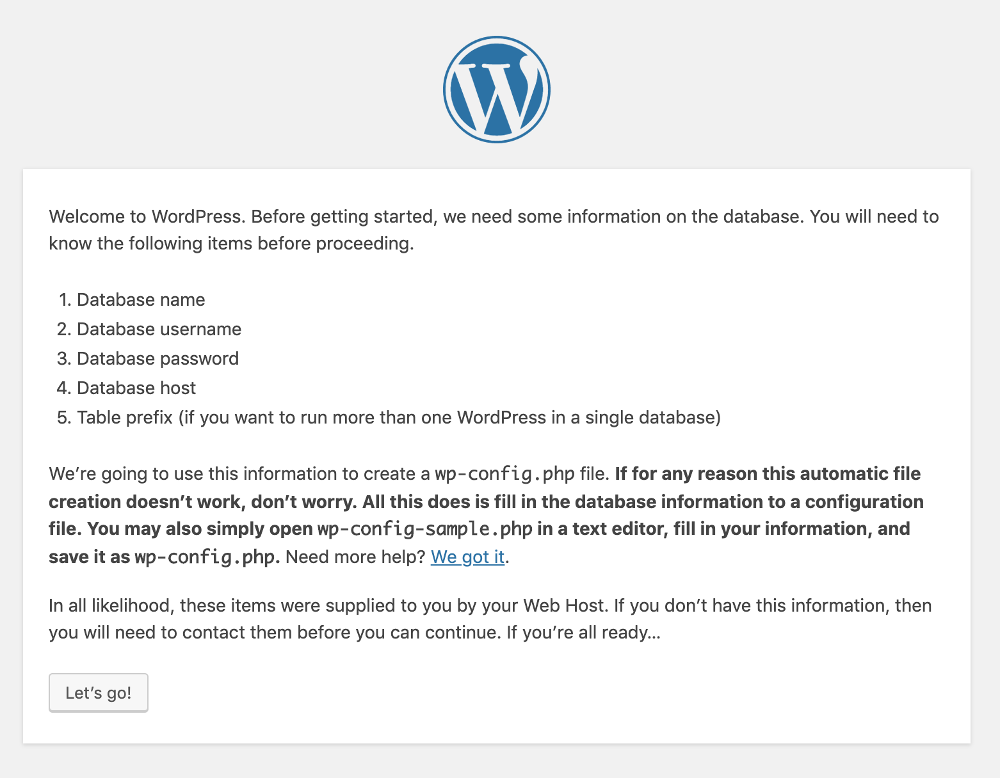
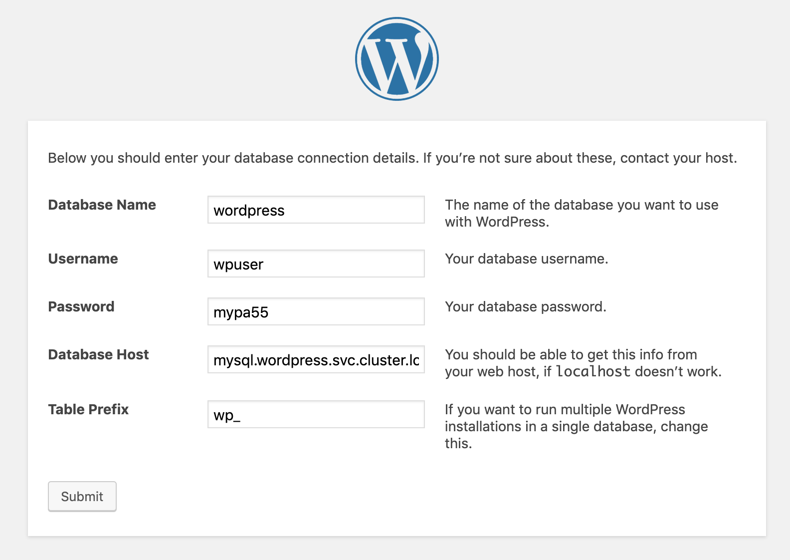
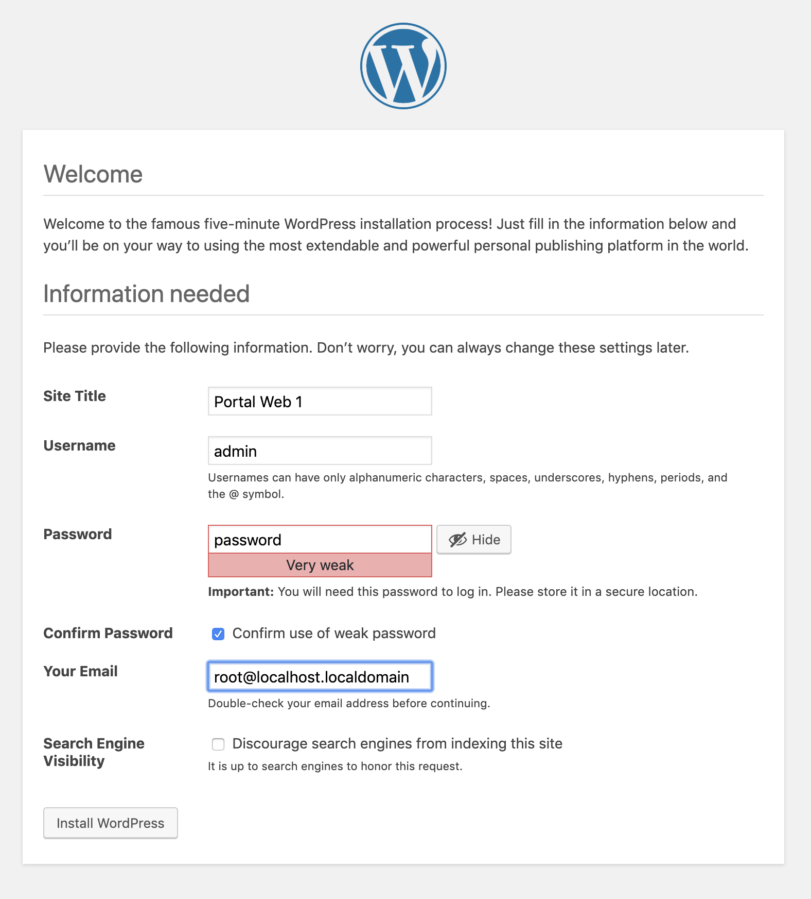
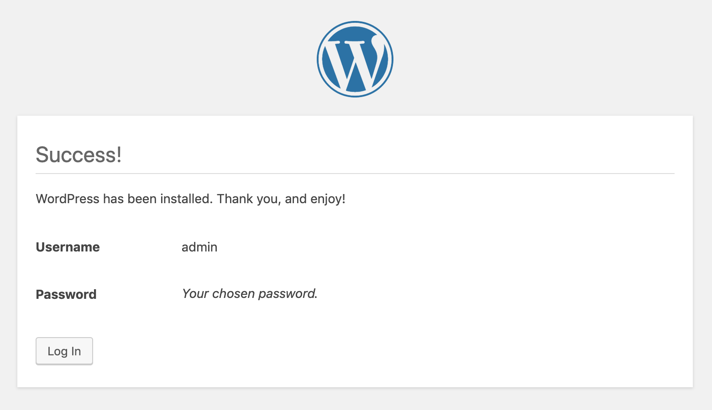

# Talleres
[Inicio](../ComandosOpenShift.md)


# Taller No 3.
Despliegue de aplicaciones mas complejas donde se cuenta con una BD y un servidor de aplicaciones

# Recuerde todos los pasos de los ejercicios anteriores para persistir los datos

1. Cree un nuevo proyecto 
```
[user01@bastion ~]$ oc new-project wordpress
Now using project "wordpress" on server "https://192.168.64.2:8443".

You can add applications to this project with the 'new-app' command. For example, try:

    oc new-app centos/ruby-25-centos7~https://github.com/sclorg/ruby-ex.git

to build a new example application in Ruby.
````
2. Cree una aplicacion de MySQL que es donde se van a almacenar los datos
```
[user01@bastion ~]$ oc new-app mysql --name=mysql -e MYSQL_USER=wpuser -e MYSQL_PASSWORD=mypa55 -e MYSQL_ROOT_PASSWORD=r00tpa55 -e MYSQL_DATABASE=wordpress
--> Found image f171d28 (10 months old) in image stream "openshift/mysql" under tag "5.7" for "mysql"

    MySQL 5.7
    ---------
    MySQL is a multi-user, multi-threaded SQL database server. The container image provides a containerized packaging of the MySQL mysqld daemon and client application. The mysqld server daemon accepts connections from clients and provides access to content from MySQL databases on behalf of the clients.

    Tags: database, mysql, mysql57, rh-mysql57

    * This image will be deployed in deployment config "mysql"
    * Port 3306/tcp will be load balanced by service "mysql"
      * Other containers can access this service through the hostname "mysql"

--> Creating resources ...
    imagestreamtag.image.openshift.io "mysql:5.7" created
    deploymentconfig.apps.openshift.io "mysql" created
    service "mysql" created
--> Success
    Application is not exposed. You can expose services to the outside world by executing one or more of the commands below:
     'oc expose svc/mysql'
    Run 'oc status' to view your app.
```

3. Verifique que el pod este en ejecucion
```
[user01@bastion ~]$ oc get pod
NAME            READY     STATUS    RESTARTS   AGE
mysql-1-84ckz   1/1       Running   0          2m
```
4. Cree la aplicacion FrontEnd que contiene el codigo fuente de la aplicacion Wordpress
```
[user01@bastion ~]$ oc new-app php~https://github.com/jmanuelcalvo/wordpress.git --name=wordpress
--> Found image 4039444 (10 months old) in image stream "openshift/php" under tag "7.1" for "php"

    Apache 2.4 with PHP 7.1
    -----------------------
    PHP 7.1 available as container is a base platform for building and running various PHP 7.1 applications and frameworks. PHP is an HTML-embedded scripting language. PHP attempts to make it easy for developers to write dynamically generated web pages. PHP also offers built-in database integration for several commercial and non-commercial database management systems, so writing a database-enabled webpage with PHP is fairly simple. The most common use of PHP coding is probably as a replacement for CGI scripts.

    Tags: builder, php, php71, rh-php71

    * A source build using source code from https://github.com/jmanuelcalvo/wordpress.git will be created
      * The resulting image will be pushed to image stream tag "wordpress:latest"
      * Use 'start-build' to trigger a new build
    * This image will be deployed in deployment config "wordpress"
    * Ports 8080/tcp, 8443/tcp will be load balanced by service "wordpress"
      * Other containers can access this service through the hostname "wordpress"

--> Creating resources ...
    imagestream.image.openshift.io "wordpress" created
    buildconfig.build.openshift.io "wordpress" created
    deploymentconfig.apps.openshift.io "wordpress" created
    service "wordpress" created
--> Success
    Build scheduled, use 'oc logs -f bc/wordpress' to track its progress.
    Application is not exposed. You can expose services to the outside world by executing one or more of the commands below:
     'oc expose svc/wordpress'
    Run 'oc status' to view your app.
```

5. Valide que la aplicacion se encuentre en ejecucion
```
[user01@bastion ~]$  oc get pod
NAME                READY     STATUS      RESTARTS   AGE
mysql-1-84ckz       1/1       Running     0          6m
wordpress-1-build   0/1       Completed   0          1m
wordpress-1-l9tnh   1/1       Running     0          25s
```

6. Validar los servicios y exponer la ruta del wordpres
```
[user01@bastion ~]$ oc get svc
NAME        TYPE        CLUSTER-IP      EXTERNAL-IP   PORT(S)             AGE
mysql       ClusterIP   172.30.84.196   <none>        3306/TCP            9m
wordpress   ClusterIP   172.30.200.65   <none>        8080/TCP,8443/TCP   3m
    
[user01@bastion ~]$ oc expose svc wordpress
route.route.openshift.io/wordpress exposed
```

7. Ingresar por el navegador a la ruta para configurar el Wordpres




8. Adicionar los parametros puestos al momento de desplegar la BD
Tenga en cuenta que los pods del mismo proyecto pueden visualizar sus servicios entre si a traves de un servicio de DNS interno llamado svc.cluster.local, por consiguiente la conexion se puede realizar de forma "interna entre los pods"

Formato
<svc>.<namespace>.svc.cluster.local









Esto quiere decir que el Wordpress se encuentra configurado

# NOTA: Animese a dejar todos los datos persistentes de acuerdo a los ejercicios anteriores


Los pasos anteriores muestran como implementar una aplicacion de forma manual, con el fin de conocer al detalle los recursos necesarios para el despliegue de varias aplicaciones tales como:

* Route
* Imagen PHP - Source Git con codigo WP
* PVC para almacenar archivos de configuracion (wp-config.php)
* Service para exponer la ruta

* Imagen MySQL - Variables de configuracion
* PVC para almacenar base de datos
* Secrets para almacenar las contraseñas de MySQL
* Service para conectar el aplicativo web internamente (mysql.project.svc.cluster.local)

## Plantilla de Wordpress
https://vocon-it.com/2018/11/05/installing-wordpress-via-openshift/


