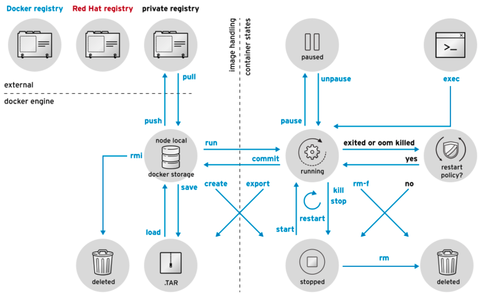

# Talleres
[Inicio](../ComandosOpenShift.md)

# Comandos Docker



# Taller No 4.
Inicio de trabajo con contenedores


# Comandos básicos

1. Buscar contenedores disponibles
```
[user01@bastion ~]$ sudo docker search centos
```
En la columna OFICIAL, OK indica una imagen creada y apoyada por la empresa detrás del proyecto.

2. Descargar el contenedor a su equipo local
```
[user01@bastion ~]$ sudo docker pull centos
```

3. Visualizar las imágenes descargadas
```
[user01@bastion ~]$ sudo docker images
```

4. Ejecutar un contenedor en modo interactivo e instalar software
```
[user01@bastion ~]$ sudo docker run -it centos bash
```
Dentro del contenedor se pueden instalar aplicaciones tal como si se estuviera dentro de un S.O
```
[root@59839a1b7de2 /]# yum -y install httpd
[root@59839a1b7de2 /]# cat << EOF > /var/www/html/index.html
<h1>Apache en un contenedor</h1>
EOF
[root@59839a1b7de2 /]# cat << EOF > /root/iniciarservicios.sh
#! /bin/bash
/usr/sbin/httpd -D FOREGROUND
EOF
[root@59839a1b7de2 /]# chmod 755 /root/iniciarservicios.sh
```
Importante: Observe el container ID en el prompt del sistema. En el ejemplo anterior, es 59839a1b7de2.

5. Una vez listo el contenedor con el software instalado y personalizado es necesario salvar los cambios
```
[root@jmanuelcalvo ~]# sudo docker commit -m "Instalacion de apache" -a "Autor Jose Manuel" 59839a1b7de2 jmanuelcalvo/centos-httpd
```

6. Ejecutar un servicio en Docker
```
[user01@bastion ~]$ sudo docker run -d -p 8001:80 --name=contenedor01-jmanuel jmanuelcalvo/centos-httpd /root/iniciarservicios.sh
[user01@bastion ~]$ sudo docker ps
CONTAINER ID        IMAGE                       COMMAND                  CREATED             STATUS              PORTS                  NAMES
1d437b546c11        jmanuelcalvo/centos-httpd   "/root/iniciarservic…"   17 seconds ago      Up 17 seconds       0.0.0.0:8001->80/tcp   contenedor01-jmanuel
[user01@bastion ~]$ curl http://localhost:8001
<h1>Apache en un contenedor</h1>
[user01@bastion ~]$ sudo docker stop contenedor01-jmanuel
```

7. Salvar y restaurar una imagen de contenedor en caso que desee guardarla o llevarla a otra maquina que soporte contenedores 
Exportar
```
[user01@bastion ~]$ sudo docker save jmanuelcalvo/centos-httpd -o centos-http.tgz 
```
Importar
```
[user01@bastion ~]$ sudo docker load --input centos-http.tgz
```

Listar los contenedores que se ejecutaron para concer su ID o los que se encuentran en ejecucion
```
[user01@bastion ~]$ sudo docker ps
[user01@bastion ~]$ sudo docker ps -a 
```
8. Borrar las imágenes descargadas 
```
[user01@bastion ~]$ sudo docker rmi 02acb16f957d
```

## Crear contenedores a partir de archivo Dockerfile

1. Crear un archivo Dockerfile con un contenido similar a:

```
cat << EOF > Dockerfile
FROM centos:7

MAINTAINER Jose Manuel Calvo <jcalvo@redhat.com>

LABEL description="A basic Apache container on RHEL 7"

RUN yum -y install -y httpd && \
    yum clean all && \
    echo "Hello from the httpd container!" > /var/www/html/index.html

EXPOSE 80

CMD  ["httpd", "-D", "FOREGROUND"]
EOF
```
2. Compilar el contenido del docker file
```
[user01@bastion ~]$ sudo docker build -t jmanuelcalvo/apache .
...
...
```

3. Validar las imagenes creadas
```
[user01@bastion ~]$ sudo docker images
REPOSITORY            TAG                 IMAGE ID            CREATED             SIZE
jmanuelcalvo/apache   latest              7b5adbdf3000        3 minutes ago       401 MB
docker.io/centos      7                   67fa590cfc1c        2 months ago        202 MB
```
4. Ejecutar el contenedor con un puerto especifico
####  NOTA: Tenga en cuenta que el puerto en este caso debe ser diferente para todos, use el asociado a su usuario (user01)10001
```
[user01@bastion ~]$ sudo docker run --name jmanuel-apache -d -p 10001:80 jmanuelcalvo/apache
88eaf45e205e5353d2af81df3028da135f30262d23919c7ce963193203c05511
```
5. Verifique la conexion con su contenedor
```
[user01@bastion ~]$ curl http://localhost:10001
```
6. Parar el conenedor
Validar su ejecucion y parar el contenedor
```
[root@bastion user01]# docker ps
CONTAINER ID        IMAGE                 COMMAND                  CREATED              STATUS              PORTS                   NAMES
88eaf45e205e        jmanuelcalvo/apache   "httpd -D FOREGROUND"    About a minute ago   Up About a minute   0.0.0.0:10080->80/tcp   jmanuel-apache
```
parar el servicio
```
[root@bastion user01]# docker stop jmanuel-apache
jmanuel-apache
```
