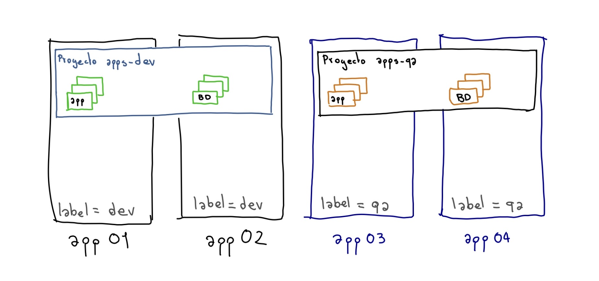

# Talleres
[Inicio](../Inicio.md)

# Tareas de Operacion de OpenShift

## Garantizar que los pods de un proyecto se ejecuten en nodos especificos



Por defecto OpenShift implementa 3 ROLES que son Master, Infra y Compute, en una configuracion por defecto los pods de las aplicaciones se ubican siobre los nodos marcados con el ROL de compute, gracias a que en la configuracion por defecto se encuentra este parametro:
```
[root@bastion ~]# vim /etc/origin/master/master-config.yaml
...
projectConfig:
  defaultNodeSelector: node-role.kubernetes.io/compute=true
...
```
Teniendio en cuenta que un cluster de OpenShift puede contar con multiples servidores de aplicaciones, la forma mas sencilla de seleccionnar los nodos es a traves de labels y anotaciones, con esto es posible garantizar que las aplicaciones se desplieguen en un nodo especifico realizando los siguiented pasos:


1. Verificar los nodos del cluster de OpenShift
```
[root@serv-mdemsbtn1 ~]# oc get nodes
NAME                             STATUS    ROLES     AGE       VERSION
app01.dominio.com.co   Ready     compute   98d       v1.11.0+d4cacc0
app02.dominio.com.co   Ready     compute   98d       v1.11.0+d4cacc0
app03.dominio.com.co   Ready     compute   98d       v1.11.0+d4cacc0
app04.dominio.com.co   Ready     compute   98d       v1.11.0+d4cacc0
inf01.dominio.com.co   Ready     infra     98d       v1.11.0+d4cacc0
inf02.dominio.com.co   Ready     infra     98d       v1.11.0+d4cacc0
inf03.dominio.com.co   Ready     infra     98d       v1.11.0+d4cacc0
master01.dominio.com.co    Ready     master    98d       v1.11.0+d4cacc0
master02.dominio.com.co    Ready     master    98d       v1.11.0+d4cacc0
master03.dominio.com.co    Ready     master    98d       v1.11.0+d4cacc0
ocs1.dominio.com.co   Ready     compute   98d       v1.11.0+d4cacc0
ocs2.dominio.com.co   Ready     compute   98d       v1.11.0+d4cacc0
ocs3.dominio.com.co   Ready     compute   98d       v1.11.0+d4cacc0
ocs4.dominio.com.co   Ready     compute   98d       v1.11.0+d4cacc0
```

2. Poner un label a los nodos
```
[root@bastion ~]# oc label node app01.dominio.com.co label=dev
[root@bastion ~]# oc label node app02.dominio.com.co label=dev
[root@bastion ~]# oc label node app03.dominio.com.co label=qa
[root@bastion ~]# oc label node app04.dominio.com.co label=qa
```

3. Validar los labels
```
[root@serv-mdemsbtn1 ~]# oc get nodes -L label
NAME                   STATUS    ROLES     AGE       VERSION            LABEL
app01.dominio.com.co   Ready     compute   98d       v1.11.0+d4cacc0    dev
app02.dominio.com.co   Ready     compute   98d       v1.11.0+d4cacc0    dev
app03.dominio.com.co   Ready     compute   98d       v1.11.0+d4cacc0    qa
app04.dominio.com.co   Ready     compute   98d       v1.11.0+d4cacc0    qa
inf01.dominio.com.co   Ready     infra     98d       v1.11.0+d4cacc0
inf02.dominio.com.co   Ready     infra     98d       v1.11.0+d4cacc0
inf03.dominio.com.co   Ready     infra     98d       v1.11.0+d4cacc0
...
```

4. Crear los proyecto especificando un NodeSelector que indique donde se van a ubicar fisicamente los pods del proyecto
oc adm new-project apps-dev --node-selector='label=dev'
oc adm new-project apps-qa --node-selector='label=qa'

5. Desplegar las aplicaciones en cada proyecto


NOTA: Edite el archivo de configuración de los masters en /etc/origin/master/master-config.yaml y agregue un valor para un selector de nodo predeterminado. Esto se aplica a los pods creados en todos los proyectos sin un valor especificado de nodeSelector
* Documentacion
* https://access.redhat.com/documentation/en-us/openshift_container_platform/3.11/html/cluster_administration/admin-guide-managing-projects#setting-the-cluster-wide-default-node-selector

## Rutas 

