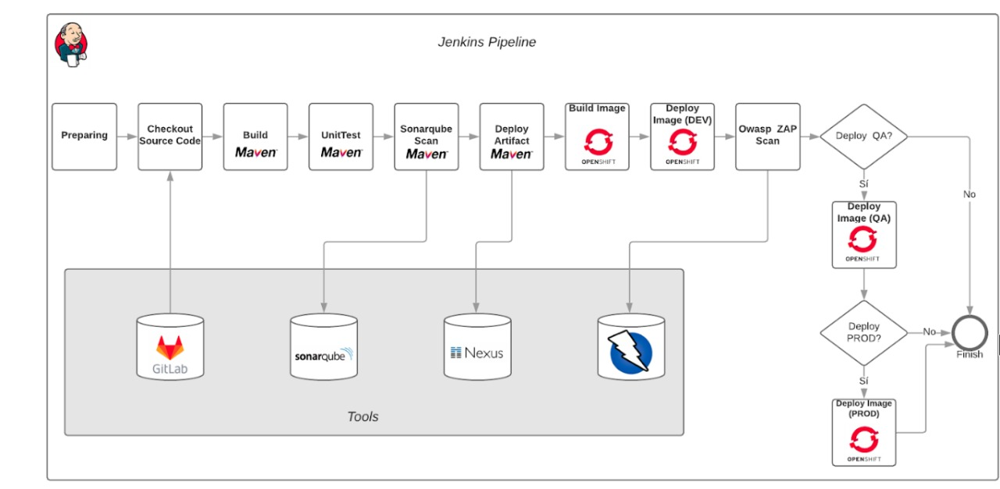
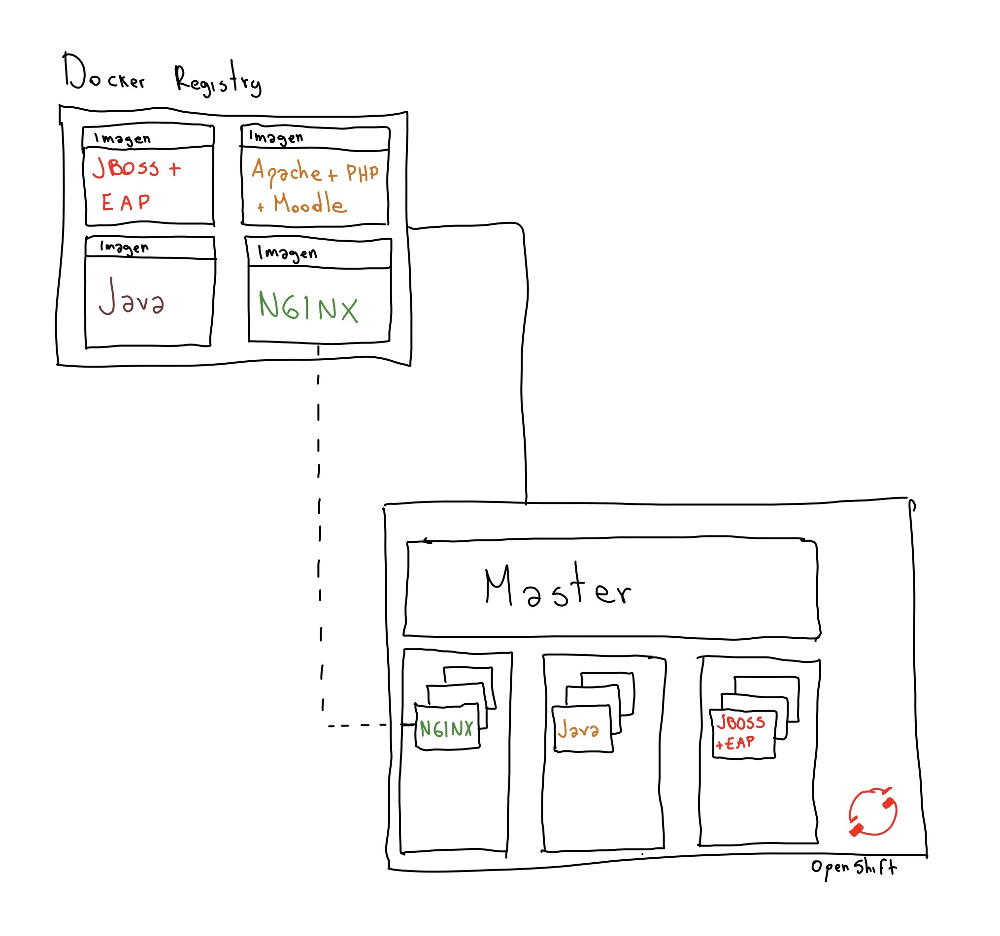

# Despliegue de aplicaciones s2i en OpenShift

Al momento de realizar el despliegue de aplicaciones debe tener en cuenta que OpenShift soporta diferentes estrategias de despliegue, entre ellas:

## Source
Se realiza el despliegue de aplicaciones a partir de una imagen de contenedor con el producto instalado (ej: PHP, JBOSS, EAP, Node) y el codigo fuente desde un servicio de SCM como github o un servidor interno.

## Pipeline
Se realiza la planeacion del despliegue desde su herramienta de pipeline y desde ahi se conecta al API del cluster de OpenShift, para realizar el despliegue

## Docker
Se utiliza el OpenShift para que ejecute una imagen de contenedor que normalmente existe en un servidor de registro privado

### [TALLER DOCKER ](../docker.md)
