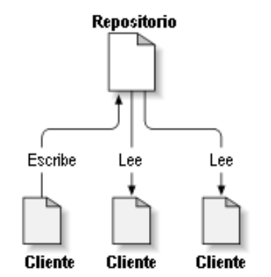
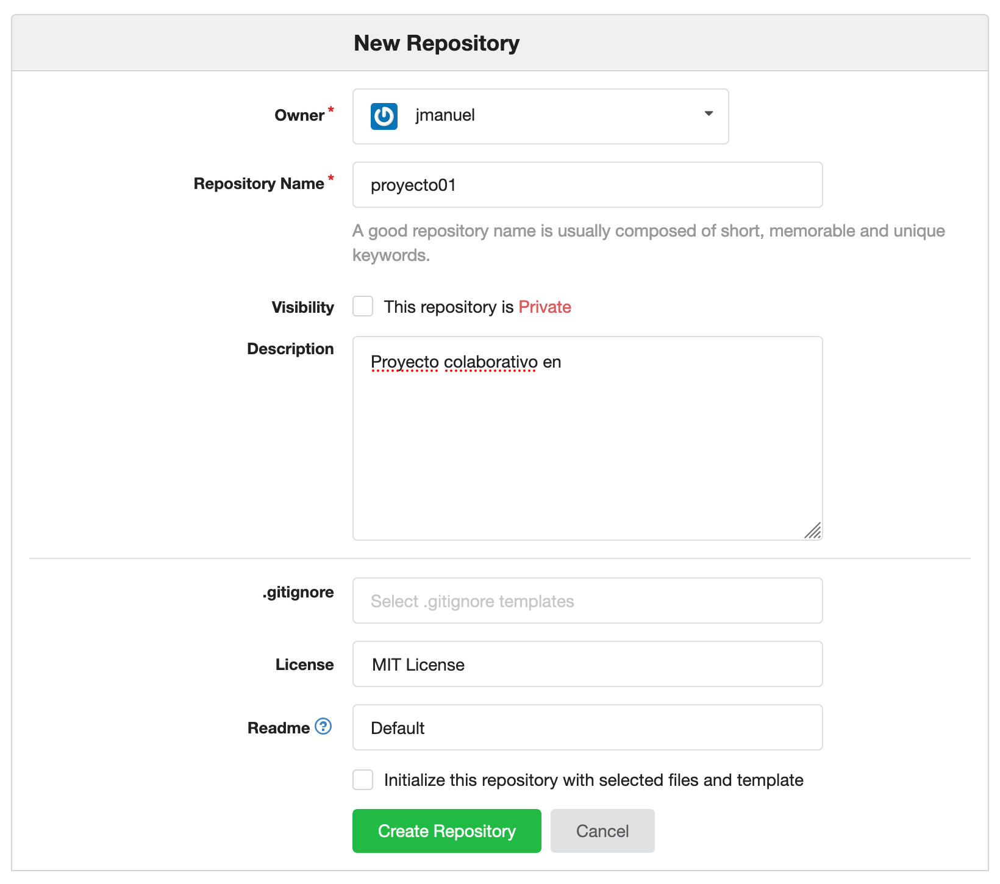
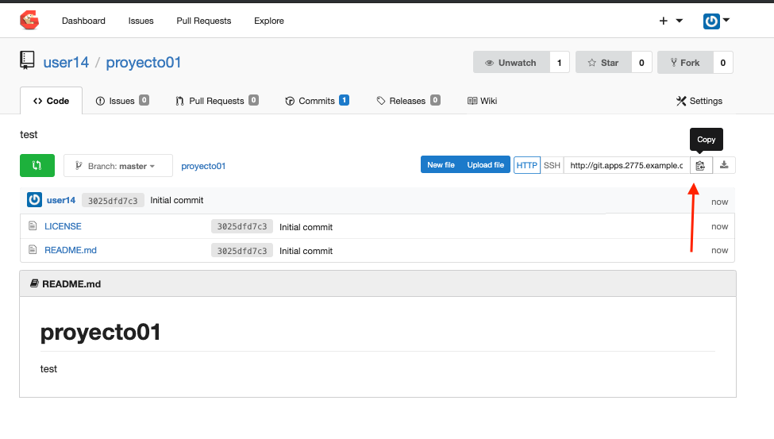
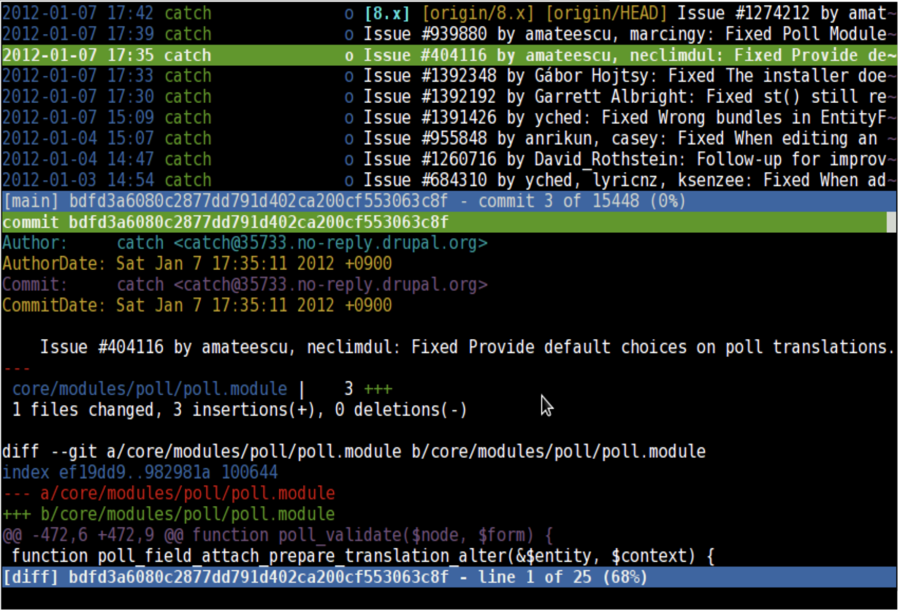

# Talleres
[Talleres de Despliegue](../despliegue.md)


# Uso basico de la herramitna GIT


# Conectarse por SSH / Putty a la maquina

### bastion.2775.example.opentlc.com con el usuario user0X

# Conceptos básicos de control de versiones
## Repositorio
Usa una base de datos central que contiene todos los archivos cuyas versiones se controlan y sus respectivas historias El repositorio normalmente esta en un servidor de archivos

## Copia de trabajo
Cada colaborador tiene su propia copia de trabajo en su computador local. Usted puede obtener la última versión del repositorio, trabajar en ella localmente sin perjudicar a nadie, y cuando esté feliz con los cambios que ha realizado puede confirmar sus cambios en el repositorio.



El repositorio almacena información en forma de un árbol de archivos, Un número de clientes se conectan al repositorio, y luego leen o escriben esos archivos.
Al escribir datos, el cliente hace que la información esté disponible para los otros; al leer los datos, el cliente recibe información de los demás.
Lo que hace al repositorio de especial es que recuerda todos los cambios que alguna vez se hayan escrito en él: cada cambio en cada archivo, e incluso los cambios en el propio árbol de directorios, como el añadir, borrar o reorganizar archivos y directorios.


# Taller - Iniciar un repositorio basico con GIT
Una vez creado el repositiorio en su servidor de repositiorios este puede ser inicializado desde la consola web o desde la terminal de comandos asi:

## Opcion 1
* Desde la Consola Web
http://git.apps.2775.example.opentlc.com 




## Opcion 2
* Desde la Terminal de comandos
En caso de querer realizar esta actividad por la terminal se deben seguir estos pasos:
```
[user0X@bastion ~]$ mkdir proyecto01

[user0X@bastion ~]$ cd proyecto01/

[user0X@bastion ~]$ touch README.md

[user0X@bastion ~]$ git init

Initialized empty Git repository in /home/jcalvo-redhat.com/abc/.git/

[user0X@bastion ~]$ git add README.md

[user0X@bastion ~]$ git commit -m "first commit"
[master (root-commit) d19a75e] first commit
 1 file changed, 0 insertions(+), 0 deletions(-)
 create mode 100644 README.md

[user0X@bastion ~]$ git remote add origin http://gogs.apps.2775.example.opentlc.com/jmanuel/proyecto01.git

[user0X@bastion ~]$ git push -u origin master
Username for 'http://gogs.apps.2775.example.opentlc.com': jmanuel
Password for 'http://jmanuel@gogs.apps.2775.example.opentlc.com':
Counting objects: 3, done.
Writing objects: 100% (3/3), 217 bytes | 0 bytes/s, done.
Total 3 (delta 0), reused 0 (delta 0)
To http://gogs.apps.2775.example.opentlc.com/jmanuel/proyecto01.git
 * [new branch]      master -> master
Branch master set up to track remote branch master from origin.
```

***NOTA*** Si realizo los pasos de la **Opcion 1** debe realizar este paso para guardar su copia en la terminal local

Copie el URL de su repositorio


Vaya a la terminal y ejecute el siguiente comando
```
[user0X@bastion ~]$ git clone http://git.apps.2775.example.opentlc.com/user0X/proyecto01.git
Cloning into 'proyecto01'...
remote: Counting objects: 4, done.
remote: Compressing objects: 100% (3/3), done.
remote: Total 4 (delta 0), reused 0 (delta 0)
Unpacking objects: 100% (4/4), done.
[user0X@bastion ~]$ cd proyecto01
```

Cree un archivo con archivo index.html con contenido
```
[user0X@bastion proyecto01]$ echo "<h1>Esta es la pagina web de Jose Manuel Calvo</h1>" > index.html
```

# Comandos basicos
Una vez adicione un archivo en su carpeta local o realice el cambios recuerde que estos cambios en principio se encuentran en su carpeta local

git diff - permite visualizar las diferencias entre los archivos desde cuando descargo su ultima copia y las modificaciones que ha realizado
Ponga nueva informacion sobre el archivo README.md y valide las diferencias
```
[user14@bastion proyecto01]$ echo "Nueva informacion del archivo README" >> README.md
[user0X@bastion proyecto1]$ git diff 
```

git add - Adiciona un archivo o varios al contenido de su copia local

```
[user0X@bastion proyecto1]$ git add .
```

git commit - Permite adicionar una descripcion de las modificaciones de esta version
```
[jcalvo-redhat.com@bastion abc]$ git commit -m "Descripcion de la version que estaba modificando"
```
***NOTA*** En caso que le aparezca un mensaje indicando ***Please tell me who you are.*** debe configurar su terminal con su nombre de usuario y correo electronico, con el fin de que el git tenga informacion de quien esta realizando cambios y realice nuevamente el commit

```
[user0X@bastion proyecto01]$ git config --global user.email "user0X@example.com"
[user0X@bastion proyecto01]$ git config --global user.name "Usuario 0X"
[user0X@bastion proyecto01]$ git commit -m "Descripcion de la version que estaba modificando"
[master 8c74aae] Descripcion de la version que estaba modificando
 2 files changed, 1 insertion(+), 1 deletion(-)
 create mode 100644 a
```


git log - Permite visualizar las diferentes versiones del proyecto
```
[user14@bastion proyecto01]$ git log
commit 8c74aae03e063178415e311ab9ab4dbd8337aec1
Author: Usuario 14 <user14@example.com>
Date:   Mon Dec 16 18:53:13 2019 +0000

    Descripcion de la version que estaba modificando

commit 3025dfd7c36bbd501c4bf8b163048e82998e2f44
Author: user14 <user14@redhat.com>
Date:   Mon Dec 16 18:42:45 2019 +0000

    Initial commit
```

git checkout version - Para volver a una version anterior de todo nuestro directorio de trabajo

***NOTA*** Ejecutelo unicamente en caso que quiera regresar a la version anterior 
```
[user0X@bastion proyecto1]$ git checkout d19a75ef658aaea3d14f9e3c8856946d72ca19c9 
```

***NOTA*** Puede unicamente recuerar un archivo de una version especifica **git checkout version -- archivo**

git push - Permite sincronizar nuestra copia local con la que esta en el servidor visible por todos los usuarios
```
Username for 'http://git.apps.2775.example.opentlc.com': user0X
Password for 'http://user14@git.apps.2775.example.opentlc.com': redhat01
Counting objects: 6, done.
Delta compression using up to 4 threads.
Compressing objects: 100% (3/3), done.
Writing objects: 100% (4/4), 390 bytes | 0 bytes/s, done.
Total 4 (delta 0), reused 0 (delta 0)
To http://git.apps.2775.example.opentlc.com/user14/proyecto01.git
   3025dfd..8c74aae  master -> master
```
Valide que la informacion se creo de manera correcta sobre el GIT




# Nota Importante

Una vez este trabajando en el git colabortivo, recuerde antes de iniciar la edicion de un archivo realizar estos pasos:

1. Para actualizar su repositorio local al commit más reciente, ejecute:
```
git pull
```

2. Edite los archivos o cree los nuevos y ejecute el commando ADD para inidicar que hay un archivo nuevo o cambiado
```
git add .
```

3. Adicione los comentarios pertinentes relacionados con el cambio que realizo
```
git commit -m "Se realizaron cambios en el README"
```

4. Publique los cambios en el servidor git
```
git push
```

Una herramienta muy útil para examinar el log de un proyecto es tig, esta nos permite visualizar de forma estructurada los últimos commits permitiendo una navegación cómoda.
```
tig
```
En caso que no este instalada se puede descargar en RHEL7 asi:
```
yum install http://download-ib01.fedoraproject.org/pub/epel/7/x86_64/Packages/t/tig-2.4.0-1.el7.x86_64.rpm
```



## Trabajo con RAMAS / BRANCH
https://desarrolloweb.com/articulos/trabajar-ramas-git.html

## Informacion adicional de git
https://github.com/INMEGEN/taller.supercomputo/blob/master/presentaciones/git.md

