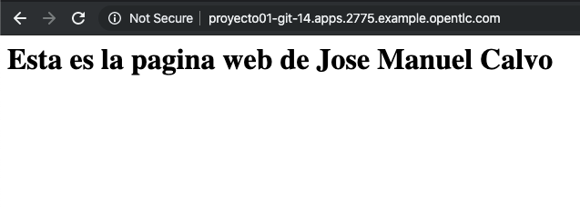

# Talleres
[Talleres de Despliegue](../despliegue.md)


# Uso basico de la herramitna GIT


# Conectarse por SSH / Putty a la maquina

### bastion.0bf3.example.opentlc.com con el usuario user0X

# Conceptos básicos de control de versiones
## Repositorio
Usa una base de datos central que contiene todos los archivos cuyas versiones se controlan y sus respectivas historias El repositorio normalmente esta en un servidor de archivos

## Copia de trabajo
Cada colaborador tiene su propia copia de trabajo en su computador local. Usted puede obtener la última versión del repositorio, trabajar en ella localmente sin perjudicar a nadie, y cuando esté feliz con los cambios que ha realizado puede confirmar sus cambios en el repositorio.


El repositorio almacena información en forma de un árbol de archivos, Un número de clientes se conectan al repositorio, y luego leen o escriben esos archivos.
Al escribir datos, el cliente hace que la información esté disponible para los otros; al leer los datos, el cliente recibe información de los demás.
Lo que hace al repositorio de especial es que recuerda todos los cambios que alguna vez se hayan escrito en él: cada cambio en cada archivo, e incluso los cambios en el propio árbol de directorios, como el añadir, borrar o reorganizar archivos y directorios.


# Taller - Iniciar un repositorio basico con GIT

## Cree un repositiorio

* Desde la Consola Web cree un nuevo repositorio 

http://git.apps.0f40.example.opentlc.com/


Luego de xrear el repositorio por la consola Web descargar una copia local del repositorio en su terminal local, vaya a la aplicacion web, ingrese a su repositorio y copie el URL.


Copie el URL de su repositorio


Vaya a la terminal y ejecute el siguiente comando
```
[user0X@bastion ~]$ git clone http://git.apps.$GUID.example.opentlc.com/user0X/proyecto01.git
Cloning into 'proyecto01'...
remote: Counting objects: 4, done.
remote: Compressing objects: 100% (3/3), done.
remote: Total 4 (delta 0), reused 0 (delta 0)
Unpacking objects: 100% (4/4), done.
[user0X@bastion ~]$ cd proyecto01
```

Cree un archivo index.html con contenido similar al siguiente
```
[user0X@bastion proyecto01]$ echo "<h1>Esta es la pagina web de Jose Manuel Calvo</h1>" > index.html
```

# Comandos basicos


Una vez adicione un archivo en su carpeta local o realice el cambios recuerde que estos cambios en principio se encuentran en su carpeta local

**git diff** - permite visualizar las diferencias entre los archivos desde cuando descargo su ultima copia y las modificaciones que ha realizado
Ponga nueva informacion sobre el archivo README.md y valide las diferencias
```
[user0X@bastion proyecto01]$ echo "Nueva informacion del archivo README" >> README.md
[user0X@bastion proyecto1]$ git diff 
```

**git add** - Adiciona un archivo o varios al contenido de su copia local

```
[user0X@bastion proyecto1]$ git add .
```

**git commit** - Permite adicionar una descripcion de las modificaciones de esta version
```
[jcalvo-redhat.com@bastion abc]$ git commit -m "Descripcion de la version que estaba modificando"
```
***NOTA*** En caso que le aparezca un mensaje indicando ***Please tell me who you are.*** debe configurar su terminal con su nombre de usuario y correo electronico, con el fin de que el git tenga informacion de quien esta realizando cambios y realice nuevamente el commit

```
[user0X@bastion proyecto01]$ git config --global user.email "user0X@example.com"
[user0X@bastion proyecto01]$ git config --global user.name "Usuario 0X"
[user0X@bastion proyecto01]$ git commit -m "Descripcion de la version que estaba modificando"
[master 8c74aae] Descripcion de la version que estaba modificando
 2 files changed, 1 insertion(+), 1 deletion(-)
 create mode 100644 a
```


**git log** - Permite visualizar las diferentes versiones del proyecto
```
[user0X@bastion proyecto01]$ git log
commit 8c74aae03e063178415e311ab9ab4dbd8337aec1
Author: Usuario 14 <user0X@example.com>
Date:   Mon Dec 16 18:53:13 2019 +0000

    Descripcion de la version que estaba modificando

commit 3025dfd7c36bbd501c4bf8b163048e82998e2f44
Author: user0X <user0X@redhat.com>
Date:   Mon Dec 16 18:42:45 2019 +0000

    Initial commit
```

**git checkout version** - Para volver a una version anterior de todo nuestro directorio de trabajo

***NOTA*** Ejecutelo unicamente en caso que quiera regresar a la version anterior 
```
[user0X@bastion proyecto1]$ git checkout d19a75ef658aaea3d14f9e3c8856946d72ca19c9 
```

***NOTA*** Puede unicamente recuerar un archivo de una version especifica **git checkout version -- archivo**

**git push** - Permite sincronizar nuestra copia local con la que esta en el servidor visible por todos los usuarios
```
[user0X@bastion proyecto1]$ git push
Username for 'http://git.apps.0bf3.example.opentlc.com': user0X
Password for 'http://user0X@git.apps.0bf3.example.opentlc.com': redhat01
Counting objects: 6, done.
Delta compression using up to 4 threads.
Compressing objects: 100% (3/3), done.
Writing objects: 100% (4/4), 390 bytes | 0 bytes/s, done.
Total 4 (delta 0), reused 0 (delta 0)
To http://git.apps.0bf3.example.opentlc.com/user0X/proyecto01.git
   3025dfd..8c74aae  master -> master
```
Valide que la informacion se creo de manera correcta sobre el GIT


### Extra
Animese a crear una nueva aplicacion con su nuevo codigo fuente desde la consola de texto o desde la interfase web:


* Desde la consola
```
[user0X@bastion proyecto01]$ oc login https://loadbalancer.$GUID.internal:443 -u user0X -p redhat01
The server uses a certificate signed by an unknown authority.
You can bypass the certificate check, but any data you send to the server could be intercepted by others.
Use insecure connections? (y/n): y

Login successful.

You don't have any projects. You can try to create a new project, by running

    oc new-project <projectname>

Welcome! See 'oc help' to get started.
[user0X@bastion proyecto01]$ oc new-project git-0X
Now using project "git-0X" on server "https://loadbalancer.2775.internal:443".

You can add applications to this project with the 'new-app' command. For example, try:

    oc new-app centos/ruby-25-centos7~https://github.com/sclorg/ruby-ex.git

to build a new example application in Ruby.

[user0X@bastion proyecto01]$ oc new-app php~http://git.apps.0bf3.example.opentlc.com/user0X/proyecto01.git
--> Found image 8e01e80 (2 weeks old) in image stream "openshift/php" under tag "7.1" for "php"

    Apache 2.4 with PHP 7.1
    -----------------------
    PHP 7.1 available as container is a base platform for building and running various PHP 7.1 applications and frameworks. PHP is an HTML-embedded scripting language. PHP attempts to make it easy for developers to write dynamically generated web pages. PHP also offers built-in database integration for several commercial and non-commercial database management systems, so writing a database-enabled webpage with PHP is fairly simple. The most common use of PHP coding is probably as a replacement for CGI scripts.

    Tags: builder, php, php71, rh-php71

    * A source build using source code from http://git.apps.0bf3.example.opentlc.com/user0X/proyecto01.git will be created
      * The resulting image will be pushed to image stream tag "proyecto01:latest"
      * Use 'start-build' to trigger a new build
    * This image will be deployed in deployment config "proyecto01"
    * Ports 8080/tcp, 8443/tcp will be load balanced by service "proyecto01"
      * Other containers can access this service through the hostname "proyecto01"

--> Creating resources ...
    imagestream.image.openshift.io "proyecto01" created
    buildconfig.build.openshift.io "proyecto01" created
    deploymentconfig.apps.openshift.io "proyecto01" created
    service "proyecto01" created
--> Success
    Build scheduled, use 'oc logs -f bc/proyecto01' to track its progress.
    Application is not exposed. You can expose services to the outside world by executing one or more of the commands below:
     'oc expose svc/proyecto01'
    Run 'oc status' to view your app.
  
    
```

Con los comandos que ya conoce, explore su ambinete y cree una ruta
```
[user0X@bastion proyecto01]$ oc get pod
NAME                 READY     STATUS      RESTARTS   AGE
proyecto01-1-build   0/1       Completed   0          1m
proyecto01-1-rgjr9   1/1       Running     0          55s

[user0X@bastion proyecto01]$ oc get svc
NAME         TYPE        CLUSTER-IP      EXTERNAL-IP   PORT(S)             AGE
proyecto01   ClusterIP   172.30.75.125   <none>        8080/TCP,8443/TCP   1m
[user0X@bastion proyecto01]$ oc expose  svc proyecto01
route.route.openshift.io/proyecto01 exposed

[user0X@bastion proyecto01]$ oc get route
NAME         HOST/PORT                                         PATH      SERVICES     PORT       TERMINATION   WILDCARD
proyecto01   proyecto01-git-14.apps.0bf3.example.opentlc.com             proyecto01   8080-tcp                 None
```

Teniendo en cuenta que conocer la ruta de publicacion, a traves de la herramienta cURL haga una peticio a su pagina
```
[user0X@bastion proyecto01]$ curl http://proyecto01-git-14.apps.0bf3.example.opentlc.com
<h1>Esta es la pagina web de Jose Manuel Calvo</h1>
```
Ingrese desde el navegador web la ruta




Valide los recursos desde la consola Web    

https://loadbalancer.0bf3.example.opentlc.com/


# Nota Importante

Una vez este trabajando en el git colabortivo, recuerde antes de iniciar la edicion de un archivo realizar estos pasos:

1. Para actualizar su repositorio local al commit más reciente, ejecute:
```
git pull
```

2. Edite los archivos o cree los nuevos y ejecute el commando ADD para inidicar que hay un archivo nuevo o cambiado
```
git add .
```

3. Adicione los comentarios pertinentes relacionados con el cambio que realizo
```
git commit -m "Se realizaron cambios en el README"
```

4. Publique los cambios en el servidor git
```
git push
```

Una herramienta muy útil para examinar el log de un proyecto es tig, esta nos permite visualizar de forma estructurada los últimos commits permitiendo una navegación cómoda.
```
tig
```
En caso que no este instalada se puede descargar en RHEL7 asi:
```
yum install http://download-ib01.fedoraproject.org/pub/epel/7/x86_64/Packages/t/tig-2.4.0-1.el7.x86_64.rpm
```


## Trabajo con RAMAS / BRANCH
https://desarrolloweb.com/articulos/trabajar-ramas-git.html

## Informacion adicional de git
https://github.com/INMEGEN/taller.supercomputo/blob/master/presentaciones/git.md

