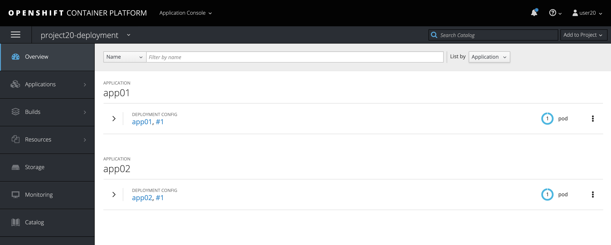
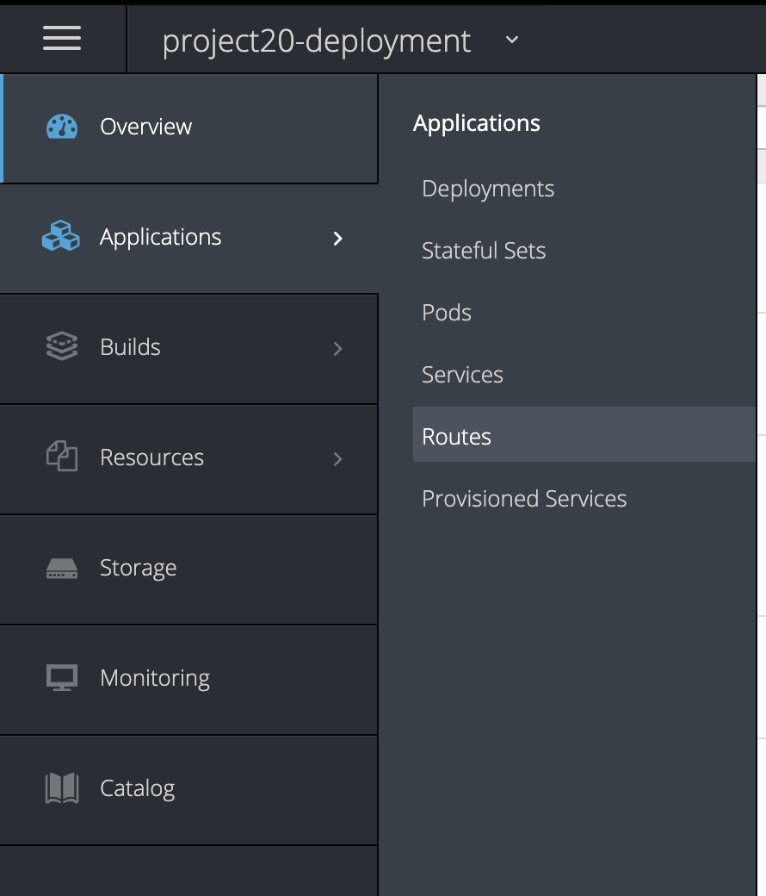
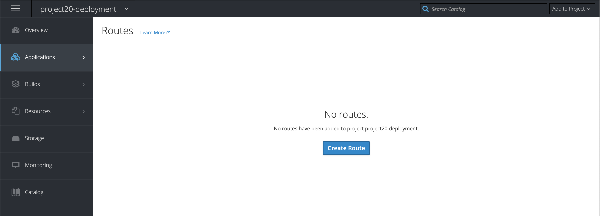
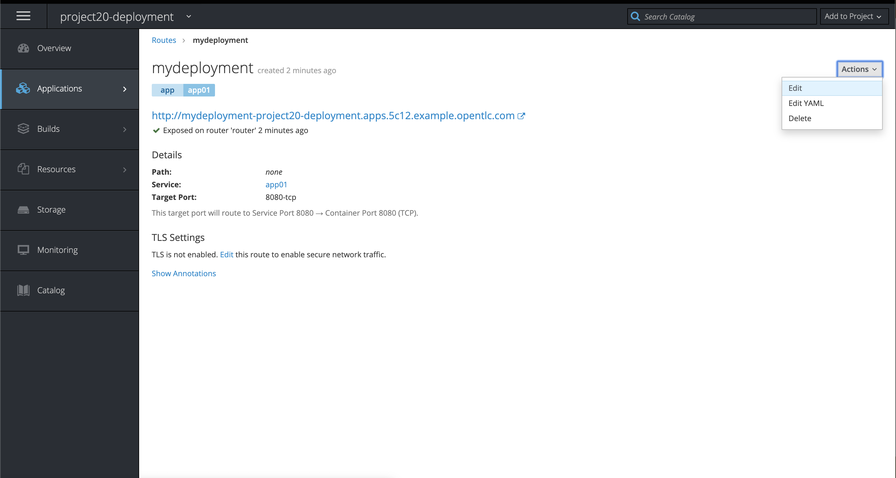
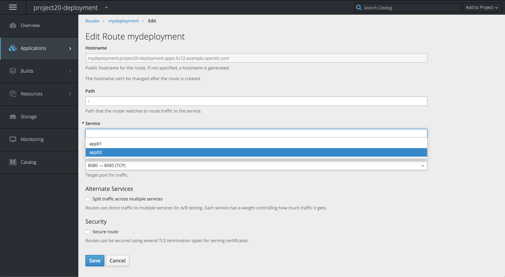
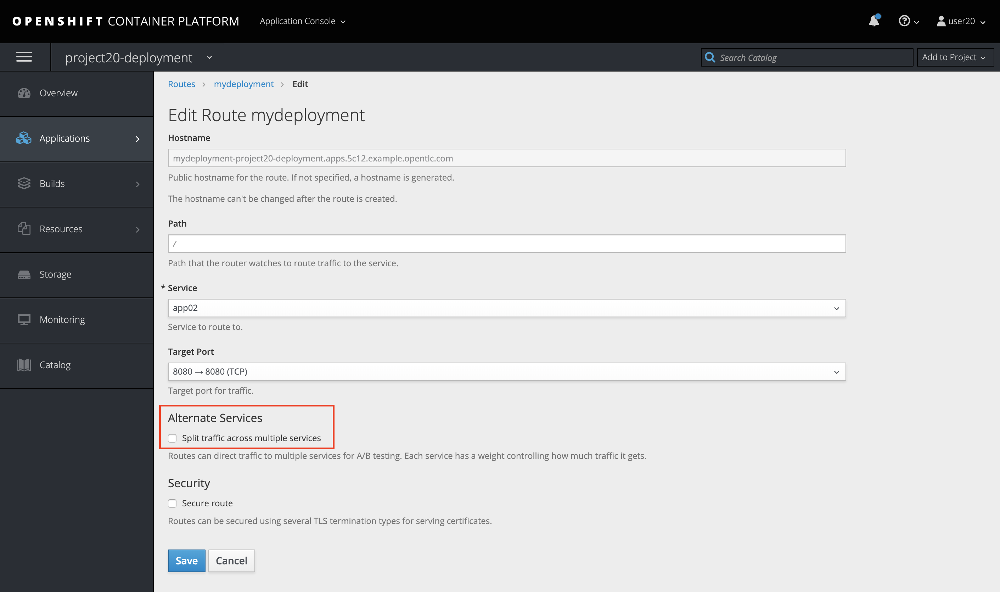

[Talleres de Despliegue](../despliegue.md)

# Monitoreo de los pods y del Cluster de OpenShift v3.11
OpenShift cuenta con la implemetancion de 


## Implementación de Blue-Green 
Las implementaciones de blue-green implican ejecutar dos versiones de una aplicación al mismo tiempo y mover el tráfico de la versión en producción (la versión verde) a la versión más nueva (la versión azul). Puede usar una estrategia continua o cambiar servicios en una ruta. Dado que muchas aplicaciones dependen de datos persistentes, deberá tener una aplicación que admita la compatibilidad N-1, lo que significa que comparte datos e implementa la migración en vivo entre su base de datos, tienda o disco creando dos copias de su capa de datos. Considere los datos utilizados para probar la nueva versión. Si se trata de los datos de producción, un error en la nueva versión puede romper la versión de producción. Uso de una implementación azul-verde Las implementaciones azul-verde usan dos configuraciones de implementación. Ambos se están ejecutando y el que está en producción depende del servicio que especifica la ruta, con cada configuración de implementación expuesta a un servicio diferente. Puede crear una nueva ruta a la nueva versión y probarla. Cuando esté listo, cambie el servicio en la ruta de producción para que apunte al nuevo servicio y la nueva versión azul esté activa. Si es necesario, puede volver a la versión anterior, verde, cambiando el servicio a la versión anterior.

### Ejemplo
Cree dos copias de la aplicación de example:
```
$ oc new-app openshift/deployment-example:v1 --name=example-green
$ oc new-app openshift/deployment-example:v2 --name=example-blue
```

Esto crea dos componentes de aplicación independientes: uno que ejecuta la imagen v1 en el servicio de ejemplo verde y otro que usa la imagen v2 en el servicio de ejemplo azul.

Cree una ruta que apunte al servicio verde:
```
$ oc expose svc/example-green --name=bluegreen-example
```

Vaya a la aplicación en ejemplo-verde. <proyecto>. <dominio_rutador> para verificar que ve la imagen v1.
```
$ oc get route
```
Edite la ruta y cambie el nombre del servicio a example-blue:
```
$ oc patch route/bluegreen-example -p '{"spec":{"to":{"name":"example-blue"}}}'
```


## Despliegue A / B
La estrategia de implementación A / B le permite probar una nueva versión de la aplicación de forma limitada en el entorno de producción. Puede especificar que la versión de producción reciba la mayoría de las solicitudes de los usuarios, mientras que una fracción limitada de las solicitudes va a la nueva versión. Como controla la parte de las solicitudes para cada versión, a medida que avanzan las pruebas, puede aumentar la fracción de solicitudes a la nueva versión y, en última instancia, dejar de usar la versión anterior. A medida que ajusta la carga de solicitud en cada versión, es posible que también se deba escalar el número de pods en cada servicio para proporcionar el rendimiento esperado.

Además de actualizar el software, puede usar esta función para experimentar con versiones de la interfaz de usuario. Dado que algunos usuarios obtienen la versión anterior y algunos la nueva, puede evaluar la reacción del usuario a las diferentes versiones para informar las decisiones de diseño.

Para que esto sea efectivo, tanto la versión antigua como la nueva deben ser lo suficientemente similares como para que ambas puedan ejecutarse al mismo tiempo. Esto es común con las versiones de corrección de errores y cuando las nuevas características no interfieren con las antiguas. Las versiones necesitan compatibilidad N-1 para funcionar correctamente juntas.

Balanceo de carga para pruebas A/B
El usuario configura una ruta con múltiples servicios. Cada servicio maneja una versión de la aplicación.

A cada servicio se le asigna un peso y la parte de las solicitudes a cada servicio es el peso del servicio dividido por la suma de los pesos. El peso de cada servicio se distribuye a los puntos finales del servicio, de modo que la suma de los pesos del punto final es el peso del servicio.

La ruta puede tener hasta cuatro servicios. El peso para el servicio puede estar entre 0 y 256. Cuando el peso es 0, el servicio no participa en el equilibrio de carga pero continúa sirviendo conexiones persistentes existentes. Cuando el peso del servicio no es 0, cada punto final tiene un peso mínimo de 1. Debido a esto, un servicio con muchos puntos finales puede terminar con un peso mayor al deseado. En este caso, reduzca el número de cápsulas para obtener el peso de equilibrio de carga deseado. Consulte la sección Backends y pesos alternativos para obtener más información.
OpenShift Container Platform admite la compatibilidad N-1 a través de la consola web y la interfaz de línea de comandos


### Ejemplo

Para configurar el entorno A/B:

Cree las dos aplicaciones y asígneles nombres diferentes. Cada uno crea una configuración de implementación. Las aplicaciones son versiones del mismo programa; una suele ser la versión de producción actual y la otra la nueva versión propuesta:
```
$ oc nueva-aplicación openshift / despliegue-ejemplo1 --nombre = ab-ejemplo-a
$ oc nueva aplicación openshift / despliegue-ejemplo2 --nombre = ab-ejemplo-b
```
Exponga la configuración de implementación para crear un servicio:
```
$ oc expose dc/ab-example-a --name=ab-example-A
$ oc expose dc/ab-example-b --name=ab-example-B
```
En este punto, ambas aplicaciones están implementadas, en ejecución y con servicios.

Haga que la aplicación esté disponible externamente a través de una ruta. Puede exponer cualquiera de los servicios en este punto, puede ser conveniente exponer la versión de producción actual y luego modificar la ruta para agregar la nueva versión.
```
$ oc expose svc/ab-example-A
```

Edite el router y adicione los pesos (weight) para cada uno de los servicios
```
$ oc edit route <route-name>
...
metadata:
  name: route-alternate-service
  annotations:
    haproxy.router.openshift.io/balance: roundrobin
spec:
  host: ab-example.my-project.my-domain
  to:
    kind: Service
    name: ab-example-A
    weight: 10
  alternateBackends:
  - kind: Service
    name: ab-example-B
    weight: 15
...
```

Tambien puede cambiar los pesos de los servicios
```
$ oc set route-backends web ab-example-A=198 ab-example-B=2
```
Esto significa que el 99% del tráfico se enviará al servicio ab-ejemplo-A y el 1% al servicio ab-ejemplo-B

Puede visualizar por la linea de comandos los pesos para cada uno de los servicios
```
$ oc set route-backends web
NAME                    KIND     TO           WEIGHT
routes/web              Service  ab-example-A 198 (99%)
routes/web              Service  ab-example-B 2   (1%)
```


## Compatibilidad N-1
Las aplicaciones que tienen código nuevo y código antiguo ejecutándose al mismo tiempo deben tener cuidado para garantizar que los datos escritos por el nuevo código puedan ser leídos y manejados (o ignorados con gracia) por la versión anterior del código. Esto a veces se llama evolución del esquema y es un problema complejo.

Esto puede tomar muchas formas: datos almacenados en el disco, en una base de datos, en un caché temporal o que es parte de la sesión del navegador de un usuario. Si bien la mayoría de las aplicaciones web pueden admitir implementaciones continuas, es importante probar y diseñar su aplicación para manejarla.

Para algunas aplicaciones, el período de tiempo que el código antiguo y el código nuevo se ejecutan uno al lado del otro es corto, por lo que se aceptan errores o algunas transacciones fallidas del usuario. Para otros, el patrón de falla puede hacer que toda la aplicación deje de funcionar.

Una forma de validar la compatibilidad N-1 es usar una implementación A / B. Ejecute el código antiguo y el código nuevo al mismo tiempo de forma controlada en un entorno de prueba y verifique que el tráfico que fluye hacia la nueva implementación no cause fallas en la implementación anterior.


# Taller
Tenga en cuenta que para los ejercicios, debe cambiar el nombre del usuario user0X por el que le fue asignado

## Ejecute los siguientes comandos:

Logueese sobre el cluster con su usuario
```
[user0X@bastion ~]$ oc login https://loadbalancer.$GUID.internal:443 -u user0X -p redhat01
```

Cree un nuevo proyecto
```
[user0X@bastion ~]$ oc new-project project0X-deployment
Now using project "project0X-deployment" on server "https://loadbalancer.5c12.internal:443".

You can add applications to this project with the 'new-app' command. For example, try:

    oc new-app centos/ruby-25-centos7~https://github.com/sclorg/ruby-ex.git

to build a new example application in Ruby.
```

Cree una aplicacion con su codigo fuente actual
```
[user0X@bastion ~]$ oc new-app php~https://github.com/jmanuelcalvo/app.git --name=app01
--> Found image 8e01e80 (5 weeks old) in image stream "openshift/php" under tag "7.1" for "php"

    Apache 2.4 with PHP 7.1
    -----------------------
    PHP 7.1 available as container is a base platform for building and running various PHP 7.1 applications and frameworks. PHP is an HTML-embedded scripting language. PHP attempts to make it easy for developers to write dynamically generated web pages. PHP also offers built-in database integration for several commercial and non-commercial database management systems, so writing a database-enabled webpage with PHP is fairly simple. The most common use of PHP coding is probably as a replacement for CGI scripts.

    Tags: builder, php, php71, rh-php71

    * A source build using source code from https://github.com/jmanuelcalvo/app.git will be created
      * The resulting image will be pushed to image stream tag "app01:latest"
      * Use 'start-build' to trigger a new build
    * This image will be deployed in deployment config "app01"
    * Ports 8080/tcp, 8443/tcp will be load balanced by service "app01"
      * Other containers can access this service through the hostname "app01"

--> Creating resources ...
    imagestream.image.openshift.io "app01" created
    buildconfig.build.openshift.io "app01" created
    deploymentconfig.apps.openshift.io "app01" created
    service "app01" created
--> Success
    Build scheduled, use 'oc logs -f bc/app01' to track its progress.
    Application is not exposed. You can expose services to the outside world by executing one or more of the commands below:
     'oc expose svc/app01'
    Run 'oc status' to view your app.
```

Cree una aplicacion con su codigo fuente nuevo
```
[user0X@bastion ~]$ oc new-app php~https://github.com/jmanuelcalvo/app2.git --name=app02
--> Found image 8e01e80 (5 weeks old) in image stream "openshift/php" under tag "7.1" for "php"

    Apache 2.4 with PHP 7.1
    -----------------------
    PHP 7.1 available as container is a base platform for building and running various PHP 7.1 applications and frameworks. PHP is an HTML-embedded scripting language. PHP attempts to make it easy for developers to write dynamically generated web pages. PHP also offers built-in database integration for several commercial and non-commercial database management systems, so writing a database-enabled webpage with PHP is fairly simple. The most common use of PHP coding is probably as a replacement for CGI scripts.

    Tags: builder, php, php71, rh-php71

    * A source build using source code from https://github.com/jmanuelcalvo/app2.git will be created
      * The resulting image will be pushed to image stream tag "app02:latest"
      * Use 'start-build' to trigger a new build
    * This image will be deployed in deployment config "app02"
    * Ports 8080/tcp, 8443/tcp will be load balanced by service "app02"
      * Other containers can access this service through the hostname "app02"

--> Creating resources ...
    imagestream.image.openshift.io "app02" created
    buildconfig.build.openshift.io "app02" created
    deploymentconfig.apps.openshift.io "app02" created
    service "app02" created
--> Success
    Build scheduled, use 'oc logs -f bc/app02' to track its progress.
    Application is not exposed. You can expose services to the outside world by executing one or more of the commands below:
     'oc expose svc/app02'
    Run 'oc status' to view your app.
```

Dentro de la interfase web deberia visualizar las aplicaciones asi:




Ahora se debe publicar la ruta de la siguiente forma




Cree la ruta ingresando los valores que estan con *


Aqui puede definir cual de los 2 servicios quiere publicar, el antiguo app01 o el nuevo app02

Ejecute una prueba publicando cada uno de los codigos e ingresando a las rutas a traves del navegador o del comando curl a la pagina hostname.php

Valide la ruta creada
```
[user0X@bastion ~]$ oc get route
NAME           HOST/PORT                                                         PATH      SERVICES   PORT       TERMINATION   WILDCARD
mydeployment   mydeployment-project0X-deployment.apps.5c12.example.opentlc.com             app01      8080-tcp                 None
```

Ingrese a la ruta con CURL o navegador

```
[user0X@bastion ~]$ curl http://mydeployment-project0X-deployment.apps.5c12.example.opentlc.com/hostname.php
Esta es la pagina de la app1. Se ejecuta en el host -> app01-1-v4tht (10.1.8.7)
```

Ahora cambie la ruta a la nueva aplicacion






y ejecute nuevamente el comando curl o ingrese por el navegador, deberia ver otra version

```
[user0X@bastion ~]$ curl http://mydeployment-project0X-deployment.apps.5c12.example.opentlc.com/hostname.php
Esta es la pagina de la app2. Se ejecuta en el host -> app02-1-79gw6 (10.1.8.8)
```

Por ultimo realice la prueba de dividir el trafico entre aplicaciones



y defina que porcentaje de peticiones desea enviar a cada una de las aplicaciones


y realice las pruebas de conexion, ejecute el comando repetidas veces y encontrara que el trafico se divide de acuerdo a los porcentajes seteados

```
[user0X@bastion ~]$ curl http://mydeployment-project0X-deployment.apps.5c12.example.opentlc.com/hostname.php
Esta es la pagina de la app1. Se ejecuta en el host -> app01-1-v4tht (10.1.8.7)

[user0X@bastion ~]$ curl http://mydeployment-project0X-deployment.apps.5c12.example.opentlc.com/hostname.php
Esta es la pagina de la app1. Se ejecuta en el host -> app01-1-v4tht (10.1.8.7)

[user0X@bastion ~]$ curl http://mydeployment-project0X-deployment.apps.5c12.example.opentlc.com/hostname.php
Esta es la pagina de la app2. Se ejecuta en el host -> app02-1-79gw6 (10.1.8.8)

[user0X@bastion ~]$ curl http://mydeployment-project0X-deployment.apps.5c12.example.opentlc.com/hostname.php
Esta es la pagina de la app2. Se ejecuta en el host -> app02-1-79gw6 (10.1.8.8)
```

FUENTES:
https://docs.openshift.com/container-platform/3.11/dev_guide/deployments/advanced_deployment_strategies.html
